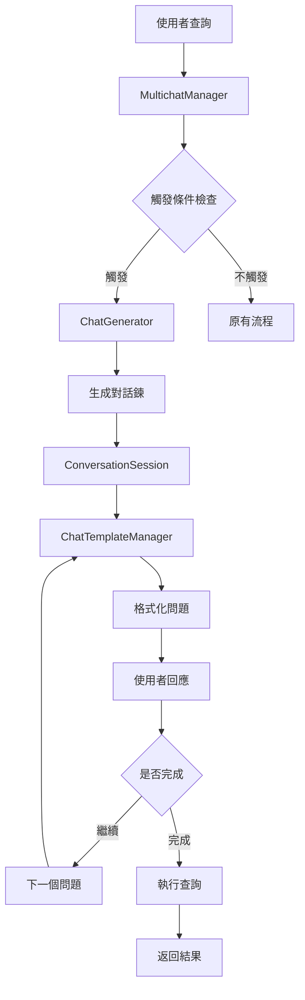
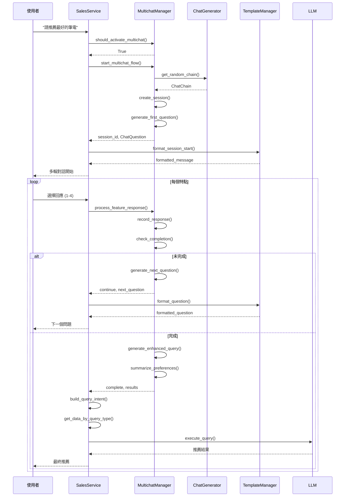

# MultiChat 多輪對話導引系統

## 系統概述

MultiChat 是一個專為 SalesRAG 系統設計的多輪對話導引功能，主要目的是將使用者從模糊的需求描述（如「最適合文書處理的NB」、「性價比最高的筆電」）逐步引導到具體明確的技術規格需求，最終提供精準的筆電機型推薦。

### 核心理念

- **從發散到聚焦**：將模糊查詢轉換為具體需求
- **系統化引導**：通過7個關鍵維度逐步收集使用者偏好
- **個人化體驗**：每次對話都有不同的問題順序，避免機械化
- **無縫整合**：與現有系統協同運作，不影響原有功能

## 系統架構

### 目錄結構
```
sales_assistant/multichat/
├── __init__.py                 # 模組初始化和導出
├── models.py                  # 資料模型定義
├── nb_features.json           # NB特點配置檔案
├── gen_chat.py               # 對話鍊生成器
├── chats.json                # 對話鍊儲存檔案
├── multichat_manager.py      # 核心多輪對話管理器
└── templates.py              # 對話模板管理器
```

### 核心組件關係圖



## 詳細設計

### 1. 觸發機制

#### 1.1 觸發條件
系統會在以下情況啟動多輪對話：

**模糊查詢關鍵字**：
- 「最適合」、「最好的」、「性價比」、「推薦」
- 「幫我找」、「不知道選哪個」、「給我建議」
- 「文書處理」、「一般使用」、「什麼比較好」

**意圖信心度不足**：
- Parent-Child 檢索系統信心度 < 0.5
- 檢測到一般意圖（general、unclear、specifications）

**實作位置**：`service.py:2403-2424`
```python
should_start_multichat = self.multichat_manager.should_activate_multichat(query)
if should_start_multichat:
    session_id, first_question = self.multichat_manager.start_multichat_flow(query)
    # 啟動多輪對話流程
```

### 2. 資料模型 (`models.py`)

#### 2.1 核心資料結構

**NBFeature** - NB特點定義
```python
@dataclass
class NBFeature:
    feature_id: str          # 特點ID (cpu, gpu, memory, 等)
    feature_type: FeatureType # 特點類型枚舉
    name: str               # 顯示名稱
    description: str        # 特點描述
    question_template: str  # 問題模板
    response_type: ResponseType # 回應類型
    options: List[FeatureOption] # 可選選項
    keywords: List[str]     # 關鍵字列表
    priority: int          # 優先級
    required: bool         # 是否必要
```

**ConversationSession** - 對話會話
```python
@dataclass
class ConversationSession:
    session_id: str                    # 會話唯一ID
    user_query: str                   # 使用者原始查詢
    chat_chain: ChatChain             # 使用的對話鍊
    current_step: int                 # 當前步驟
    total_steps: int                  # 總步驟數
    collected_responses: List[FeatureResponse] # 收集的回應
    session_state: Dict[str, Any]     # 會話狀態
    created_at: str                   # 建立時間
    updated_at: str                   # 更新時間
    is_complete: bool                 # 是否完成
```

**ChatChain** - 對話鍊
```python
@dataclass
class ChatChain:
    chain_id: str              # 對話鍊ID
    features_order: List[str]  # 特點順序列表
    strategy: str             # 生成策略
    created_at: str           # 建立時間
    status: str               # 狀態
```

#### 2.2 枚舉定義

**FeatureType** - 特點類型
- CPU, GPU, MEMORY, STORAGE, SIZE, WEIGHT, PRICE

**ResponseType** - 回應類型
- SINGLE_CHOICE, MULTIPLE_CHOICE, RANGE_INPUT, TEXT_INPUT

### 3. NB特點配置 (`nb_features.json`)

#### 3.1 檔案結構
```json
{
  "nb_features": {
    "cpu": { /* CPU處理器配置 */ },
    "gpu": { /* GPU顯卡配置 */ },
    "memory": { /* 記憶體配置 */ },
    "storage": { /* 儲存配置 */ },
    "size": { /* 螢幕尺寸配置 */ },
    "weight": { /* 重量配置 */ },
    "price": { /* 價格配置 */ }
  },
  "feature_priorities": { /* 不同場景的優先級 */ },
  "trigger_keywords": { /* 觸發關鍵字 */ }
}
```

#### 3.2 特點配置範例 - CPU
```json
"cpu": {
  "feature_id": "cpu",
  "feature_type": "cpu",
  "name": "處理器(CPU)偏好",
  "description": "選擇適合您使用需求的處理器類型",
  "question_template": "請問您對處理器(CPU)有什麼偏好嗎？",
  "response_type": "single_choice",
  "keywords": ["CPU", "處理器", "運算", "Intel", "AMD"],
  "priority": 1,
  "required": true,
  "options": [
    {
      "option_id": "high_performance",
      "label": "🚀 高效能處理器",
      "description": "適合遊戲、創作、多工處理",
      "keywords": ["高效能", "遊戲", "創作"],
      "db_filter": {
        "cpu_tier": "high",
        "cpu_cores": ">=6"
      }
    }
  ]
}
```

#### 3.3 場景優先級
```json
"feature_priorities": {
  "gaming": ["gpu", "cpu", "memory", "storage", "price", "size", "weight"],
  "business": ["weight", "cpu", "price", "size", "memory", "storage", "gpu"],
  "creation": ["gpu", "cpu", "memory", "storage", "size", "weight", "price"],
  "study": ["price", "weight", "cpu", "memory", "size", "storage", "gpu"],
  "general": ["price", "cpu", "memory", "gpu", "size", "storage", "weight"]
}
```

### 4. 對話鍊生成器 (`gen_chat.py`)

#### 4.1 ChatGenerator 類別

**主要功能**：
- 生成隨機排列的對話鍊
- 支援多種生成策略
- 管理對話鍊的儲存和載入

**生成策略**：
1. **random** - 完全隨機排列
2. **priority_based** - 基於場景優先級
3. **user_history** - 基於使用者歷史（未來擴展）

#### 4.2 核心方法

**generate_random_chain()**
```python
def generate_random_chain(self, strategy: str = "random") -> ChatChain:
    """生成隨機對話鍊"""
    if strategy == "random":
        features_order = self._generate_random_order()
    elif strategy == "priority_based":
        features_order = self._generate_priority_based_order()
    
    return ChatChain(
        chain_id=generate_id(),
        features_order=features_order,
        strategy=strategy
    )
```

**_add_randomness_to_priority()**
```python
def _add_randomness_to_priority(self, priority_order: List[str]) -> List[str]:
    """在優先級基礎上增加隨機性"""
    # 前3個保持較高優先級，但可能有輕微調整
    high_priority = priority_order[:3]
    random.shuffle(high_priority)
    
    # 中間特點完全隨機
    mid_priority = priority_order[3:6]
    random.shuffle(mid_priority)
    
    # 最後特點隨機
    low_priority = priority_order[6:]
    random.shuffle(low_priority)
    
    return high_priority + mid_priority + low_priority
```

#### 4.3 儲存機制

對話鍊會儲存到 `chats.json`，格式如下：
```json
{
  "chat_chains": [
    {
      "chain_id": "uuid-string",
      "features_order": ["cpu", "gpu", "memory", "storage", "size", "weight", "price"],
      "strategy": "random",
      "created_at": "2024-01-01T00:00:00",
      "status": "active"
    }
  ],
  "metadata": {
    "total_chains": 100,
    "last_updated": "2024-01-01T00:00:00",
    "generator_version": "1.0.0"
  }
}
```

### 5. 多輪對話管理器 (`multichat_manager.py`)

#### 5.1 MultichatManager 類別

**核心職責**：
- 管理整個多輪對話流程
- 觸發條件判斷
- 會話狀態管理
- 使用者回應處理

#### 5.2 關鍵方法

**should_activate_multichat()**
```python
def should_activate_multichat(self, query: str, intent_result: Dict = None) -> bool:
    """判斷是否應該啟動多輪對話"""
    vague_keywords = self.trigger_keywords.get("vague_queries", [])
    
    # 檢查模糊查詢關鍵字
    for keyword in vague_keywords:
        if keyword in query.lower():
            return True
    
    # 檢查意圖信心度
    if intent_result and intent_result.get("confidence_score", 1.0) < 0.5:
        return True
    
    return False
```

**start_multichat_flow()**
```python
def start_multichat_flow(self, query: str, user_context: Dict = None, 
                        strategy: str = "random") -> Tuple[str, ChatQuestion]:
    """開始多輪對話流程"""
    
    # 1. 生成對話鍊
    chat_chain = self.chat_generator.get_random_chain(strategy)
    
    # 2. 建立會話
    session = ConversationSession(
        session_id=generate_id(),
        user_query=query,
        chat_chain=chat_chain,
        current_step=0,
        total_steps=len(chat_chain.features_order)
    )
    
    # 3. 儲存會話
    self.active_sessions[session.session_id] = session
    
    # 4. 生成第一個問題
    first_question = self._generate_next_question(session)
    
    return session.session_id, first_question
```

**process_feature_response()**
```python
def process_feature_response(self, session_id: str, user_choice: str, 
                           user_input: str = "") -> Dict:
    """處理使用者對特點的回應"""
    
    session = self.active_sessions[session_id]
    current_feature_id = session.chat_chain.features_order[session.current_step]
    
    # 記錄回應
    response = FeatureResponse(
        response_id=generate_id(),
        feature_id=current_feature_id,
        feature_type=FeatureType(current_feature_id),
        user_choice=user_choice,
        user_input=user_input
    )
    
    session.collected_responses.append(response)
    session.current_step += 1
    
    if session.current_step >= session.total_steps:
        # 對話完成
        return {
            "action": "complete",
            "enhanced_query": self._generate_enhanced_query(session),
            "collected_preferences": self._summarize_preferences(session),
            "db_filters": self._generate_db_filters(session)
        }
    else:
        # 繼續下一問題
        return {
            "action": "continue",
            "next_question": self._generate_next_question(session),
            "current_step": session.current_step,
            "total_steps": session.total_steps
        }
```

#### 5.3 查詢增強機制

**_generate_enhanced_query()**
```python
def _generate_enhanced_query(self, session: ConversationSession) -> str:
    """基於收集的回應生成增強查詢"""
    preferences = []
    
    for response in session.collected_responses:
        feature = self.nb_features[response.feature_id]
        selected_option = self._find_option_by_id(feature, response.user_choice)
        
        if selected_option and response.user_choice not in ["no_preference"]:
            clean_label = self._clean_emoji_from_label(selected_option.label)
            preferences.append(f"{feature.name}: {clean_label}")
    
    if preferences:
        return f"根據以下偏好條件：{' | '.join(preferences)}，{session.user_query}"
    else:
        return session.user_query
```

**_generate_db_filters()**
```python
def _generate_db_filters(self, session: ConversationSession) -> Dict:
    """生成資料庫查詢篩選條件"""
    filters = {}
    
    for response in session.collected_responses:
        feature = self.nb_features[response.feature_id]
        selected_option = self._find_option_by_id(feature, response.user_choice)
        
        if selected_option and selected_option.db_filter:
            filters.update(selected_option.db_filter)
    
    return filters
```

### 6. 對話模板管理器 (`templates.py`)

#### 6.1 ChatTemplateManager 類別

**主要功能**：
- 格式化對話問題顯示
- 管理各種回應模板
- 生成進度指示器

#### 6.2 問題模板

**多輪對話問題模板**：
```python
multichat_question = """
🤖 **為了為您推薦最適合的筆電，我需要了解您的具體需求**

📋 **進度**: 第 {current_step} 步，共 {total_steps} 步

❓ **{question_text}**

請選擇最符合您需求的選項：

{options_text}

💡 *提示: 如果不確定，可以選擇「沒有偏好」，系統會根據其他條件為您推薦*
"""
```

**會話開始模板**：
```python
session_start = """
🚀 **開始多輪對話引導**

您的問題是：「{user_query}」

我將通過幾個簡單的問題來了解您的具體需求，幫您找到最適合的筆電機型。

{first_question}
"""
```

#### 6.3 格式化方法

**format_question()**
```python
def format_question(self, question: ChatQuestion, current_step: int, 
                   total_steps: int) -> str:
    """格式化問題顯示"""
    
    # 格式化選項
    options_text = ""
    for i, option in enumerate(question.options, 1):
        option_text = f"**{i}** - {option.label}\n   {option.description}"
        options_text += option_text + "\n"
    
    # 生成進度條
    progress_bar = self._generate_progress_bar(current_step, total_steps)
    
    # 格式化完整問題
    return self.question_templates["multichat_question"].format(
        current_step=current_step,
        total_steps=total_steps,
        question_text=question.question_text,
        options_text=options_text.strip(),
        progress_bar=progress_bar
    )
```

**_generate_progress_bar()**
```python
def _generate_progress_bar(self, current: int, total: int, width: int = 10) -> str:
    """生成進度條顯示"""
    filled = int((current / total) * width)
    empty = width - filled
    
    progress_bar = "▓" * filled + "▒" * empty
    percentage = int((current / total) * 100)
    
    return f"{progress_bar} {percentage}%"
```

### 7. 系統整合 (`service.py`)

#### 7.1 整合點

**初始化**（第73-75行）：
```python
# 初始化多輪對話管理器
self.multichat_manager = MultichatManager()
self.chat_template_manager = ChatTemplateManager()
```

**觸發檢查**（第2403-2424行）：
```python
# 檢查是否應該啟動多輪對話導引
should_start_multichat = self.multichat_manager.should_activate_multichat(query)
if should_start_multichat:
    session_id, first_question = self.multichat_manager.start_multichat_flow(query)
    formatted_question = self.chat_template_manager.format_session_start(query, ...)
    
    # 以串流方式返回多輪對話開始訊息
    yield f"data: {json.dumps({'type': 'multichat_start', ...})}\n\n"
    return
```

#### 7.2 新增API方法

**process_multichat_response()**（第4451行）：
```python
async def process_multichat_response(self, session_id: str, user_choice: str, 
                                   user_input: str = ""):
    """處理多輪對話回應"""
    
    # 1. 獲取會話狀態
    session = self.multichat_manager.get_session_state(session_id)
    
    # 2. 處理數字選擇轉換
    actual_choice = self._convert_choice_to_option_id(user_choice, session)
    
    # 3. 處理回應
    result = self.multichat_manager.process_feature_response(session_id, actual_choice)
    
    # 4. 根據結果類型返回對應格式
    if result["action"] == "continue":
        return self._format_continue_response(result)
    elif result["action"] == "complete":
        return await self._execute_final_query(result)
```

**_build_query_intent_from_multichat()**（第4558行）：
```python
def _build_query_intent_from_multichat(self, multichat_result: dict) -> dict:
    """從多輪對話結果構建查詢意圖"""
    
    preferences = multichat_result.get("collected_preferences", {})
    
    query_intent = {
        "modelnames": [],
        "modeltypes": ["819", "839", "958"],
        "intents": [],
        "primary_intent": "multichat_guided",
        "query_type": "model_type",
        "confidence_score": 0.95,
        "multichat_enhanced": True
    }
    
    # 根據GPU偏好調整系列
    if "gpu" in preferences:
        gpu_pref = preferences["gpu"]["selected_option"]
        if "遊戲級" in gpu_pref or "創作級" in gpu_pref:
            query_intent["modeltypes"] = ["958"]
        elif "內建顯卡" in gpu_pref:
            query_intent["modeltypes"] = ["819", "839"]
    
    return query_intent
```

**_execute_multichat_query()**（第4628行）：
```python
async def _execute_multichat_query(self, query_intent: dict, preferences_summary: dict, 
                                 enhanced_query: str):
    """執行多輪對話引導的查詢"""
    
    # 獲取資料
    context_list_of_dicts, target_modelnames = self._get_data_by_query_type(query_intent)
    
    # 構建包含偏好的上下文
    multichat_context = {
        "data": context_list_of_dicts,
        "query_intent": query_intent,
        "user_preferences": preferences_summary,
        "guided_query": enhanced_query
    }
    
    # 構建專用提示模板
    multichat_prompt = f"""
根據用戶通過多輪對話明確表達的需求偏好：
{preferences_text}

請基於以下資訊提供精準的筆電推薦：
- 所有偏好都已通過系統性問答收集
- 推薦應嚴格符合用戶明確表達的偏好
{self.prompt_template}
"""
    
    # 調用LLM並返回結果
    return self._parse_llm_response(response_str, preferences_summary)
```

## 運作流程

### 1. 完整對話流程



### 2. 觸發判斷邏輯

```python
def should_activate_multichat(query: str) -> bool:
    # 1. 檢查模糊查詢關鍵字
    vague_keywords = ["最適合", "最好的", "性價比", "推薦", "幫我找"]
    if any(keyword in query.lower() for keyword in vague_keywords):
        return True
    
    # 2. 檢查比較查詢但無具體機型
    comparison_keywords = ["比較", "差別", "哪個好"]
    if any(keyword in query.lower() for keyword in comparison_keywords):
        if not has_specific_models(query):
            return True
    
    # 3. 檢查意圖信心度
    if intent_confidence < 0.5:
        return True
    
    return False
```

### 3. 對話鍊生成邏輯

```python
def generate_chat_chain(strategy: str) -> List[str]:
    base_features = ["cpu", "gpu", "memory", "storage", "size", "weight", "price"]
    
    if strategy == "random":
        return random.shuffle(base_features)
    
    elif strategy == "priority_based":
        # 根據場景優先級排序
        priority_order = get_priority_for_scenario(scenario)
        return add_randomness_to_priority(priority_order)
    
    elif strategy == "user_history":
        # 未來基於使用者歷史的智慧排序
        return generate_history_based_order()
```

### 4. 回應處理邏輯

```python
def process_user_response(session_id: str, choice: str) -> Dict:
    session = get_session(session_id)
    current_feature = get_current_feature(session)
    
    # 數字轉選項ID
    if choice.isdigit():
        option_index = int(choice) - 1
        actual_choice = current_feature.options[option_index].option_id
    else:
        actual_choice = choice
    
    # 記錄回應
    response = FeatureResponse(
        feature_id=current_feature.feature_id,
        user_choice=actual_choice,
        timestamp=now()
    )
    session.collected_responses.append(response)
    
    # 檢查完成狀態
    session.current_step += 1
    if session.current_step >= session.total_steps:
        return complete_session(session)
    else:
        return continue_session(session)
```

## 系統特色與優勢

### 1. 智慧觸發機制

**準確識別模糊查詢**：
- 關鍵字匹配：「最適合」、「最好」、「性價比」
- 意圖信心度：自動檢測低信心度查詢
- 具體機型排除：避免對明確查詢的誤觸發

**無縫整合**：
- 不影響現有具體查詢功能
- 與Parent-Child檢索協同運作
- 保持系統向後相容性

### 2. 個人化對話體驗

**隨機化問題順序**：
- 每次對話都有不同的詢問順序
- 避免機械化的問答體驗
- 支援多種生成策略

**場景感知排序**：
- 遊戲場景：GPU → CPU → Memory 優先
- 商務場景：Weight → CPU → Price 優先
- 創作場景：GPU → CPU → Memory → Storage 優先

### 3. 系統化需求收集

**7個關鍵維度**：
1. **CPU處理器**：高效能/平衡/節能
2. **GPU顯卡**：遊戲級/創作級/內建
3. **Memory記憶體**：32GB+/16GB/8GB
4. **Storage儲存**：1TB+/512GB/256GB/高速
5. **Size螢幕尺寸**：17"+/15-16"/13-14"
6. **Weight重量**：超輕薄/便攜/桌機替代
7. **Price價格**：經濟/中階/高階/旗艦

**智慧篩選轉換**：
- 將使用者偏好轉換為資料庫查詢條件
- 基於選擇智慧調整機型系列範圍
- 生成增強查詢字串提升LLM理解

### 4. 模組化架構設計

**清晰的職責分離**：
- MultichatManager：核心流程管理
- ChatGenerator：對話鍊生成
- ChatTemplateManager：顯示格式化
- Models：資料結構定義

**易於擴展維護**：
- JSON配置化：新增特點只需修改配置檔案
- 插件式設計：新增生成策略不影響現有功能
- 模板化顯示：調整顯示格式不需改動邏輯

### 5. 完整的狀態管理

**會話生命週期**：
- 建立：生成唯一session_id
- 進行：逐步收集使用者回應
- 完成：生成增強查詢執行搜尋
- 清理：自動清理過期會話

**容錯機制**：
- 無效選擇處理
- 會話超時管理
- 錯誤恢復策略

## 配置與自訂

### 1. 新增特點

要新增新的NB特點，需要修改 `nb_features.json`：

```json
{
  "nb_features": {
    "new_feature": {
      "feature_id": "new_feature",
      "feature_type": "new_feature",
      "name": "新特點名稱",
      "description": "特點描述",
      "question_template": "請問您對新特點有什麼需求？",
      "response_type": "single_choice",
      "keywords": ["關鍵字1", "關鍵字2"],
      "priority": 8,
      "required": true,
      "options": [
        {
          "option_id": "option1",
          "label": "選項1",
          "description": "選項描述",
          "keywords": ["選項關鍵字"],
          "db_filter": {
            "field_name": "filter_value"
          }
        }
      ]
    }
  }
}
```

同時需要更新 `models.py` 中的 FeatureType 枚舉：

```python
class FeatureType(Enum):
    # 現有特點...
    NEW_FEATURE = "new_feature"
```

### 2. 自訂觸發關鍵字

修改 `nb_features.json` 中的 trigger_keywords：

```json
{
  "trigger_keywords": {
    "vague_queries": [
      "最適合", "最好的", "性價比", "推薦",
      "自訂關鍵字1", "自訂關鍵字2"
    ],
    "comparison_queries": [
      "比較", "差別", "哪個好", "vs", "對比"
    ]
  }
}
```

### 3. 調整場景優先級

修改 `feature_priorities` 設定：

```json
{
  "feature_priorities": {
    "custom_scenario": [
      "priority_feature1", 
      "priority_feature2", 
      "priority_feature3"
    ]
  }
}
```

### 4. 自訂顯示模板

修改 `templates.py` 中的模板：

```python
def _get_question_templates(self) -> Dict[str, str]:
    return {
        "multichat_question": """
        🤖 **自訂標題**
        
        📋 **進度**: 第 {current_step} 步，共 {total_steps} 步
        
        ❓ **{question_text}**
        
        {options_text}
        """,
        # 其他模板...
    }
```

## 測試與驗證

### 1. 單元測試範例

**觸發條件測試**：
```python
def test_multichat_trigger():
    manager = MultichatManager()
    
    # 應該觸發的查詢
    assert manager.should_activate_multichat("請推薦最好的筆電") == True
    assert manager.should_activate_multichat("性價比最高的NB") == True
    
    # 不應該觸發的查詢
    assert manager.should_activate_multichat("AG958的CPU規格") == False
    assert manager.should_activate_multichat("比較AG958和AHP839") == False
```

**對話鍊生成測試**：
```python
def test_chat_generation():
    generator = ChatGenerator()
    
    # 測試隨機生成
    chain1 = generator.get_random_chain("random")
    chain2 = generator.get_random_chain("random")
    assert chain1.features_order != chain2.features_order
    
    # 測試優先級生成
    chain3 = generator.get_random_chain("priority_based")
    assert len(chain3.features_order) == 7
    assert set(chain3.features_order) == set(["cpu", "gpu", "memory", ...])
```

### 2. 整合測試

**完整對話流程測試**：
```python
def test_full_conversation():
    manager = MultichatManager()
    
    # 開始對話
    session_id, first_question = manager.start_multichat_flow("推薦筆電")
    
    # 模擬使用者回應
    for i in range(7):  # 7個特點
        result = manager.process_feature_response(session_id, "1", "")
        
        if i < 6:
            assert result["action"] == "continue"
            assert "next_question" in result
        else:
            assert result["action"] == "complete"
            assert "enhanced_query" in result
            assert "collected_preferences" in result
```

### 3. 效能測試

**並發會話測試**：
```python
def test_concurrent_sessions():
    manager = MultichatManager()
    sessions = []
    
    # 建立多個並發會話
    for i in range(100):
        session_id, _ = manager.start_multichat_flow(f"查詢{i}")
        sessions.append(session_id)
    
    # 驗證會話獨立性
    assert len(manager.active_sessions) == 100
    for session_id in sessions:
        assert session_id in manager.active_sessions
```

## 監控與維護

### 1. 日誌記錄

系統會記錄以下關鍵事件：

```python
logging.info(f"檢測到模糊查詢，啟動多輪對話導引: {query}")
logging.info(f"開始多輪對話: {session_id}, 對話鍊: {features_order}")
logging.info(f"處理多輪對話回應: session_id={session_id}, choice={user_choice}")
logging.info(f"多輪對話完成: {session_id}, 收集偏好: {preferences_count}")
```

### 2. 效能指標

**關鍵指標**：
- 觸發準確率：正確觸發模糊查詢的比例
- 完成率：使用者完成完整對話流程的比例
- 平均對話長度：使用者平均回答多少個問題
- 查詢滿意度：最終推薦結果的相關性評分

### 3. 會話清理

```python
def cleanup_expired_sessions(self, hours: int = 24):
    """清理過期的會話"""
    current_time = datetime.now()
    expired_sessions = []
    
    for session_id, session in self.active_sessions.items():
        created_time = datetime.fromisoformat(session.created_at)
        if (current_time - created_time).total_seconds() > hours * 3600:
            expired_sessions.append(session_id)
    
    for session_id in expired_sessions:
        del self.active_sessions[session_id]
        logging.info(f"清理過期會話: {session_id}")
```

## 未來擴展方向

### 1. 智慧化改進

**使用者歷史學習**：
- 記錄使用者偏好模式
- 基於歷史選擇調整問題順序
- 個人化推薦策略

**自適應對話長度**：
- 根據使用者回應信心度動態調整問題數量
- 提前結束低價值問題
- 深入探索關鍵偏好

### 2. 多模態支援

**圖像選擇**：
- 提供視覺化的選項選擇
- 筆電外觀偏好收集
- 使用場景圖像引導

**語音交互**：
- 語音問答支援
- 自然語言回應解析
- 多語言支援

### 3. 高級分析

**對話路徑分析**：
- 分析最有效的問題順序
- 識別使用者決策模式
- 優化對話流程設計

**A/B測試框架**：
- 不同問題表述的效果比較
- 對話策略效能評估
- 持續優化改進

### 4. 擴展應用場景

**其他產品類別**：
- 手機推薦多輪對話
- 相機設備選擇引導
- 家電產品需求收集

**B2B應用**：
- 企業採購需求收集
- 大批量訂單客製化
- 專業用途深度諮詢

## 結語

MultiChat 多輪對話導引系統成功實現了從模糊需求到精準推薦的完整轉換流程。通過系統化的問答設計、智慧化的觸發機制、個人化的對話體驗，以及完整的技術架構，為使用者提供了一個自然、高效的筆電選購諮詢體驗。

系統的模組化設計和配置化管理確保了良好的可擴展性和維護性，為未來的功能增強和應用擴展奠定了堅實的基礎。隨著使用資料的累積和使用者反饋的收集，系統將能夠持續優化改進，提供更加精準和個人化的推薦服務。