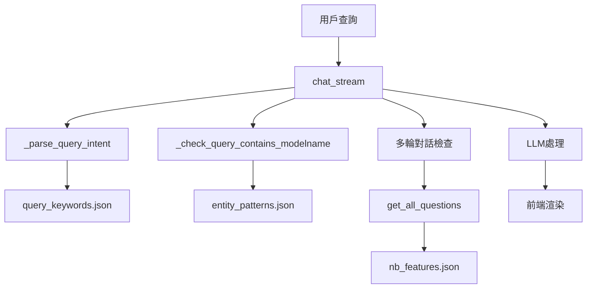
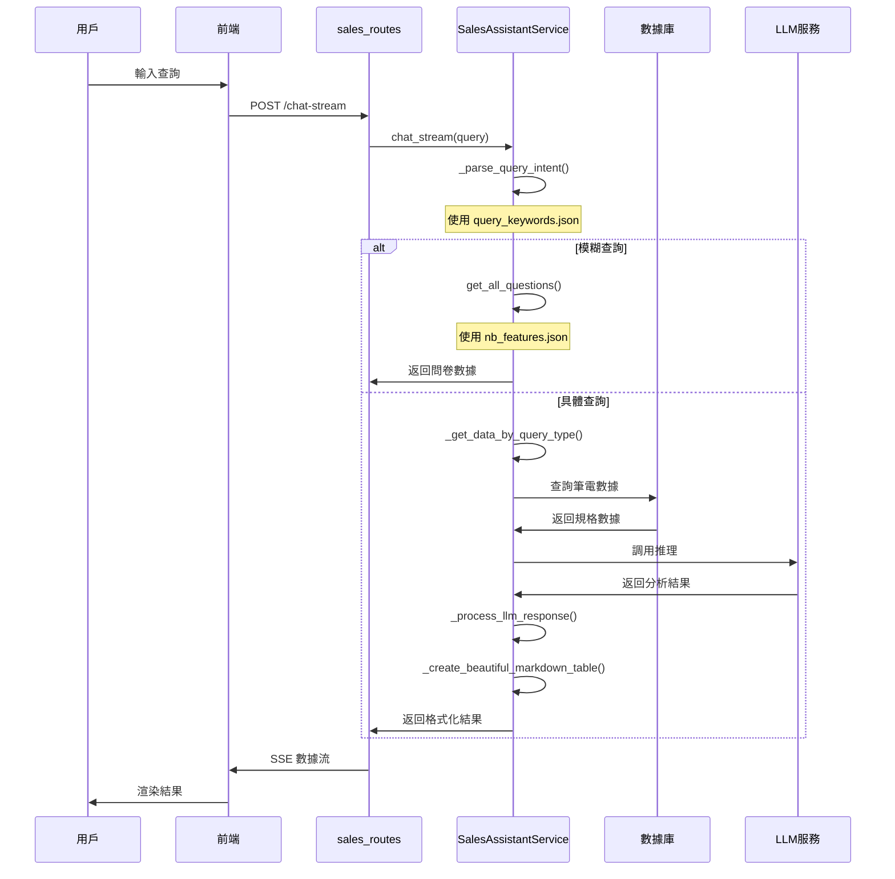
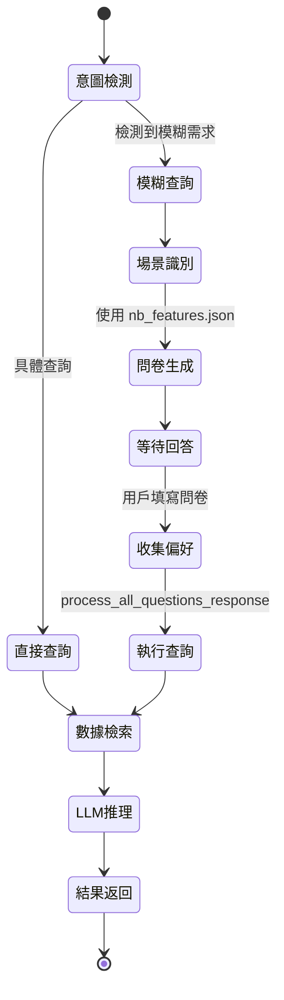

# SalesAssistantService 核心函數極詳細解釋

## 📋 目錄

1. [系統初始化與配置管理類](#系統初始化與配置管理類)
2. [數據探索與獲取類](#數據探索與獲取類)
3. [查詢分析與意圖識別類](#查詢分析與意圖識別類)
4. [表格藝術與格式化類](#表格藝術與格式化類)
5. [數據處理與修復類](#數據處理與修復類)
6. [LLM交互與智能處理類](#llm交互與智能處理類)
7. [多輪對話管理類](#多輪對話管理類)
8. [配置文件關係圖解](#配置文件關係圖解)

---

## 🏗️ 系統初始化與配置管理類

### 1. `__init__()` - 系統總指揮官的就職典禮

#### 🎭 函數身份證
- **函數角色**: 像一位新上任的 CEO，需要熟悉公司各部門、建立管理體系、配置核心資源
- **核心使命**: 初始化 SalesAssistantService 的所有核心組件和依賴項
- **重要等級**: ⭐⭐⭐⭐⭐ (系統生命週期的起點)
- **調用頻率**: 低 (通常只在系統啟動時調用一次)
- **複雜度**: 中等 (需要協調多個子系統)

#### 📊 輸入輸出解剖
```python
def __init__(self):
    # 輸入: 無顯式參數，但依賴全域配置
    # 輸出: 完全初始化的 SalesAssistantService 實例
```

**輸入詳解:**
- 無直接參數，但依賴於：
  - 全域變數 `AVAILABLE_MODELNAMES` 和 `AVAILABLE_MODELTYPES`
  - 環境變數和配置文件 (`config.py`)
  - 外部服務 (DuckDB, Milvus, Ollama LLM)

**輸出詳解:**
- 返回完全初始化的服務實例，包含：
  - `self.llm`: LLM 實例 (DeepSeek-R1 模型)
  - `self.milvus_query`: 向量數據庫查詢器
  - `self.duckdb_query`: 結構化數據庫查詢器
  - `self.prompt_template`: 預載的提示模板
  - `self.intent_keywords`: 意圖關鍵字配置
  - `self.multichat_manager`: 多輪對話管理器
  - `self.spec_fields`: 規格欄位定義列表

#### 🔄 實作邏輯深度解析

**第一階段: LLM 初始化 (第88-90行)**
```python
self.llm_initializer = LLMInitializer()
self.llm = self.llm_initializer.get_llm()
```
**隱喻**: 就像 CEO 第一天上班，先確保有一位優秀的顧問 (LLM) 可以提供智能建議。

**詳細過程**:
1. 創建 `LLMInitializer` 實例
2. 調用 `get_llm()` 方法連接到 Ollama 服務
3. 預設使用 "deepseek-r1:7b" 模型，溫度設為 0.1 (相對保守的回應)

**第二階段: 數據庫連接建立 (第92-96行)**
```python
self.milvus_query = MilvusQuery(collection_name="sales_notebook_specs")
from config import DB_PATH
self.duckdb_query = DuckDBQuery(db_file=str(DB_PATH))
```
**隱喻**: CEO 建立與兩個重要部門的聯繫 - 情報部門 (Milvus向量搜索) 和檔案部門 (DuckDB結構化查詢)。

**第三階段: 模板和配置載入 (第98-101行)**
```python
self.prompt_template = self._load_prompt_template("sales_rag_app/libs/services/sales_assistant/prompts/sales_prompt.txt")
self.intent_keywords = self._load_intent_keywords("sales_rag_app/libs/services/sales_assistant/prompts/query_keywords.json")
```
**隱喻**: CEO 閱讀公司的標準作業程序 (SOP) 和客戶服務手冊。

**第四階段: 多輪對話系統初始化 (第103-105行)**
```python
self.multichat_manager = MultichatManager()
self.chat_template_manager = ChatTemplateManager()
```
**隱喻**: 建立客戶服務部門，配備專業的對話流程顧問。

**第五階段: 規格欄位定義 (第108-116行)**
```python
self.spec_fields = [
    'modeltype', 'version', 'modelname', 'mainboard', 'devtime',
    'pm', 'structconfig', 'lcd', 'touchpanel', 'iointerface', 
    # ... 更多欄位
]
```
**隱喻**: 制定公司的產品分類標準，確保所有員工使用統一的術語。

#### 🎯 實戰範例演示

**範例 1: 成功初始化**
```python
# 調用
service = SalesAssistantService()

# 期望結果
assert service.llm is not None  # LLM 成功載入
assert service.duckdb_query is not None  # 數據庫連接正常
assert len(service.spec_fields) == 26  # 所有規格欄位已定義
assert 'cpu' in service.intent_keywords  # 意圖關鍵字已載入
```

**範例 2: 配置文件缺失的錯誤處理**
```python
# 如果 query_keywords.json 不存在
# _load_intent_keywords() 會返回空字典
# service.intent_keywords = {}  # 不會中斷初始化，但功能受限
```

**範例 3: 數據庫連接失敗**
```python
# 如果 DuckDB 檔案不存在或損壞
# DuckDBQuery 構造函數會拋出異常
# 這會導致整個初始化失敗
```

#### 🔗 配置文件關係詳解

**與 `query_keywords.json` 的關係:**
- **讀取時機**: 初始化時立即載入
- **使用方式**: 通過 `_load_intent_keywords()` 讀取
- **數據結構**:
```json
{
  "intent_keywords": {
    "cpu": {
      "keywords": ["cpu", "處理器", "processor"],
      "description": "CPU相關查詢"
    }
  }
}
```
- **影響範圍**: 影響整個服務的意圖識別能力

**與 `sales_prompt.txt` 的關係:**
- **讀取時機**: 初始化時載入為模板
- **使用方式**: 作為 LLM 的提示詞基礎
- **預處理**: 支援 `{context}` 和 `{query}` 變數替換

#### 💡 開發者指南

**如何擴展初始化過程:**
1. **添加新的數據源**: 在第二階段後添加新的查詢器
2. **增加配置文件**: 在第三階段添加新的載入邏輯
3. **修改規格欄位**: 更新 `spec_fields` 列表以匹配數據庫結構

**常見陷阱:**
- ❌ 忘記處理配置文件缺失的情況
- ❌ 假設所有外部服務都能正常連接
- ❌ 硬編碼文件路徑，不考慮部署環境差異

**調試技巧:**
- 🔍 檢查日誌輸出，確認每個組件的初始化狀態
- 🔍 使用 `hasattr()` 檢查屬性是否正確設置
- 🔍 分階段測試，逐個驗證每個組件

---

### 2. `_load_prompt_template()` - 劇本導演的台詞本讀取器

#### 🎭 函數身份證
- **函數角色**: 像一位劇場導演的助手，負責從檔案櫃中取出演員的台詞本
- **核心使命**: 從指定路徑讀取 LLM 提示詞模板文件
- **重要等級**: ⭐⭐⭐ (影響 LLM 回應品質)
- **調用頻率**: 低 (通常只在初始化時調用)
- **複雜度**: 簡單 (純文件讀取操作)

#### 📊 輸入輸出解剖

```python
def _load_prompt_template(self, path: str) -> str:
    # 輸入: 文件路徑字串
    # 輸出: 提示詞模板內容 (字串)
```

**輸入參數詳解:**
- `path: str`: 提示詞模板文件的絕對或相對路徑
  - 範例: `"sales_rag_app/libs/services/sales_assistant/prompts/sales_prompt.txt"`
  - 預期文件格式: UTF-8 編碼的純文字檔
  - 支援變數: `{context}`, `{query}` 等預留位置

**輸出結果詳解:**
- 返回完整的提示詞模板字串
- 包含用於 LLM 的指令、格式要求、範例等
- 支援多行文本，保留原始格式

#### 🔄 實作邏輯深度解析

```python
def _load_prompt_template(self, path: str) -> str:
    with open(path, 'r', encoding='utf-8') as f:
        return f.read()
```

**詳細執行步驟:**
1. **文件開啟**: 使用 UTF-8 編碼開啟指定路徑的文件
2. **內容讀取**: 一次性讀取整個文件內容到記憶體
3. **自動關閉**: 使用 `with` 語句確保文件正確關閉

**錯誤處理分析:**
- 目前實作沒有顯式錯誤處理
- 可能拋出的異常:
  - `FileNotFoundError`: 文件不存在
  - `PermissionError`: 沒有讀取權限
  - `UnicodeDecodeError`: 文件編碼問題

#### 🎯 實戰範例演示

**範例 1: 成功載入提示詞**
```python
# 假設 sales_prompt.txt 內容如下:
"""
你是一位專業的筆電銷售顧問。
請根據以下資訊回答用戶問題:

資料: {context}
問題: {query}

請以 JSON 格式回應，包含:
- answer_summary: 詳細分析
- comparison_table: 比較表格
"""

# 函數調用
template = service._load_prompt_template("prompts/sales_prompt.txt")

# 期望結果
assert "{context}" in template
assert "{query}" in template
assert "JSON" in template
```

**範例 2: 文件不存在的處理**
```python
try:
    template = service._load_prompt_template("nonexistent_file.txt")
except FileNotFoundError:
    print("提示詞模板文件不存在")
    # 應該使用預設模板或拋出更友善的錯誤
```

**範例 3: 編碼問題處理**
```python
# 如果文件包含非 UTF-8 字符
try:
    template = service._load_prompt_template("bad_encoding.txt")
except UnicodeDecodeError:
    print("文件編碼不正確，請確保使用 UTF-8")
```

#### 🔗 配置文件關係詳解

**與 `sales_prompt.txt` 的關係:**
- **文件結構**: 純文字檔，包含 LLM 指令
- **變數佔位符**: 
  - `{context}`: 會被實際的筆電規格資料替換
  - `{query}`: 會被用戶的查詢內容替換
- **格式要求**: 檔案中定義了期望的回應格式 (JSON)

**模板內容範例:**
```text
你是筆電銷售專家，請分析以下資料：

上下文資訊: {context}
用戶查詢: {query}

請以 JSON 格式回應：
{
  "answer_summary": "詳細的回答摘要",
  "comparison_table": [
    {"feature": "CPU", "model1": "spec1", "model2": "spec2"}
  ]
}
```

#### 💡 開發者指南

**如何改進這個函數:**
```python
def _load_prompt_template(self, path: str) -> str:
    try:
        with open(path, 'r', encoding='utf-8') as f:
            content = f.read()
            if not content.strip():
                raise ValueError("提示詞模板文件為空")
            return content
    except FileNotFoundError:
        logging.error(f"提示詞模板文件不存在: {path}")
        return self._get_default_prompt_template()
    except UnicodeDecodeError:
        logging.error(f"提示詞模板編碼錯誤: {path}")
        raise ValueError("文件必須使用 UTF-8 編碼")
```

**擴展功能建議:**
1. **模板驗證**: 檢查必要的佔位符是否存在
2. **模板快取**: 避免重複讀取相同文件
3. **動態載入**: 支援運行時重新載入模板
4. **多語言支援**: 根據語言設定載入不同模板

---

### 3. `_load_intent_keywords()` - 智能詞典管理員

#### 🎭 函數身份證
- **函數角色**: 像一位圖書館的參考諮詢專家，維護著一本詳細的「用戶意圖識別詞典」
- **核心使命**: 載入和解析查詢意圖關鍵字配置文件，為意圖識別提供基礎
- **重要等級**: ⭐⭐⭐⭐ (直接影響查詢理解能力)
- **調用頻率**: 低 (初始化和重新載入時)
- **複雜度**: 中等 (包含 JSON 解析和錯誤處理)

#### 📊 輸入輸出解剖

```python
def _load_intent_keywords(self, path: str) -> dict:
    # 輸入: JSON 配置文件路徑
    # 輸出: 意圖關鍵字字典
```

**輸入參數詳解:**
- `path: str`: 指向 `query_keywords.json` 的文件路徑
- 檔案格式要求:
  ```json
  {
    "intent_keywords": {
      "cpu": {
        "keywords": ["cpu", "處理器", "processor"],
        "description": "CPU相關查詢"
      }
    }
  }
  ```

**輸出結果詳解:**
- 成功時: 返回嵌套字典結構
  ```python
  {
    "cpu": {
      "keywords": ["cpu", "處理器", "processor"],
      "description": "CPU相關查詢"
    },
    "gpu": {
      "keywords": ["gpu", "顯卡", "graphics"],
      "description": "GPU相關查詢"
    }
  }
  ```
- 失敗時: 返回空字典 `{}`

#### 🔄 實作邏輯深度解析

**第一階段: 安全載入與解析 (第126-130行)**
```python
try:
    with open(path, 'r', encoding='utf-8') as f:
        config = json.load(f)
        logging.info(f"成功載入關鍵字配置: {list(config.get('intent_keywords', {}).keys())}")
        return config.get('intent_keywords', {})
```

**隱喻**: 圖書館員小心翼翼地打開珍貴的參考書，確認內容完整後將其中的「意圖索引」提取出來。

**詳細執行步驟:**
1. 使用 UTF-8 編碼開啟 JSON 文件
2. 調用 `json.load()` 解析 JSON 內容
3. 提取 `intent_keywords` 部分，忽略其他可能的配置
4. 記錄成功載入的意圖類型列表

**第二階段: 多層錯誤處理 (第131-139行)**
```python
except FileNotFoundError:
    logging.error(f"關鍵字配置文件不存在: {path}")
    return {}
except json.JSONDecodeError as e:
    logging.error(f"關鍵字配置文件格式錯誤: {e}")
    return {}
except Exception as e:
    logging.error(f"載入關鍵字配置時發生錯誤: {e}")
    return {}
```

**錯誤處理策略分析:**
- **FileNotFoundError**: 檔案不存在，記錄錯誤但不中斷系統
- **JSONDecodeError**: JSON 格式錯誤，提供具體錯誤信息
- **通用異常**: 捕獲所有其他可能的錯誤

#### 🎯 實戰範例演示

**範例 1: 成功載入完整配置**
```python
# query_keywords.json 內容:
{
  "intent_keywords": {
    "cpu": {
      "keywords": ["cpu", "處理器", "processor", "ryzen"],
      "description": "CPU相關查詢"
    },
    "gpu": {
      "keywords": ["gpu", "顯卡", "graphics", "radeon"],
      "description": "GPU相關查詢"
    },
    "memory": {
      "keywords": ["記憶體", "內存", "memory", "ram", "ddr"],
      "description": "記憶體相關查詢"
    }
  }
}

# 函數調用
keywords = service._load_intent_keywords("prompts/query_keywords.json")

# 驗證結果
assert "cpu" in keywords
assert "gpu" in keywords
assert "memory" in keywords
assert len(keywords["cpu"]["keywords"]) == 4
assert keywords["cpu"]["description"] == "CPU相關查詢"
```

**範例 2: 處理格式錯誤的 JSON**
```python
# 損壞的 query_keywords.json:
{
  "intent_keywords": {
    "cpu": {
      "keywords": ["cpu", "處理器",  // 缺少結尾引號
      "description": "CPU相關查詢"
    }
  }
}

# 函數調用
keywords = service._load_intent_keywords("broken_keywords.json")

# 期望結果
assert keywords == {}  # 返回空字典
# 日誌會記錄: "關鍵字配置文件格式錯誤: Expecting ',' delimiter..."
```

**範例 3: 處理空配置文件**
```python
# 空的 query_keywords.json:
{}

# 函數調用
keywords = service._load_intent_keywords("empty_keywords.json")

# 結果分析
assert keywords == {}  # 因為沒有 'intent_keywords' 鍵
# 但不會報錯，系統會正常運行，只是意圖識別功能受限
```

**範例 4: 處理不完整的配置結構**
```python
# 不完整的 query_keywords.json:
{
  "intent_keywords": {
    "cpu": {
      "keywords": ["cpu", "處理器"]
      // 缺少 "description" 欄位
    }
  }
}

# 函數調用會成功，但後續使用時需要檢查欄位存在性
keywords = service._load_intent_keywords("incomplete_keywords.json")
description = keywords.get("cpu", {}).get("description", "無描述")
```

#### 🔗 配置文件關係詳解

**與 `query_keywords.json` 的深度整合:**

**文件結構詳解:**
```json
{
  "intent_keywords": {
    "display": {
      "keywords": ["螢幕", "顯示", "screen", "lcd", "面板"],
      "description": "螢幕相關查詢"
    },
    "cpu": {
      "keywords": ["cpu", "處理器", "processor", "ryzen"],
      "description": "CPU相關查詢"
    },
    "comparison": {
      "keywords": ["比較", "compare", "差異", "difference", "不同"],
      "description": "比較相關查詢"
    }
  }
}
```

**數據流向分析:**
1. **載入階段**: `_load_intent_keywords()` → `self.intent_keywords`
2. **使用階段**: `_parse_query_intent()` 使用這些關鍵字進行意圖匹配
3. **更新階段**: `add_intent_keyword()`, `remove_intent_keyword()` 修改內容
4. **保存階段**: `save_intent_keywords()` 將修改寫回文件

**關鍵字匹配邏輯:**
```python
# 在 _parse_query_intent() 中的使用範例
query_lower = query.lower()
for intent_name, intent_config in self.intent_keywords.items():
    keywords = intent_config.get("keywords", [])
    if any(keyword.lower() in query_lower for keyword in keywords):
        result["intent"] = intent_name
        break
```

#### 💡 開發者指南

**如何擴展關鍵字配置:**

1. **添加新意圖類型:**
```json
{
  "intent_keywords": {
    "gaming": {
      "keywords": ["遊戲", "電競", "gaming", "fps", "高畫質"],
      "description": "遊戲效能相關查詢"
    }
  }
}
```

2. **多語言支援:**
```json
{
  "intent_keywords": {
    "cpu": {
      "keywords": ["cpu", "處理器", "processor", "プロセッサー", "processeur"],
      "description": "CPU相關查詢（多語言）"
    }
  }
}
```

**性能優化建議:**
- 📊 **快取機制**: 載入後快取結果，避免重複文件讀取
- 📊 **關鍵字索引**: 建立反向索引，加速關鍵字查找
- 📊 **懶加載**: 只在需要時載入特定意圖的關鍵字

**常見陷阱和解決方案:**
- ❌ **關鍵字重複**: 不同意圖包含相同關鍵字會導致衝突
  - ✅ 解決: 按優先級排序，或使用權重機制
- ❌ **大小寫不一致**: 忘記統一關鍵字大小寫
  - ✅ 解決: 在載入時統一轉換為小寫
- ❌ **特殊字符處理**: 關鍵字包含正則表達式特殊字符
  - ✅ 解決: 使用 `re.escape()` 進行轉義

---

## 🔍 數據探索與獲取類

### 4. `_get_available_modelnames_from_db()` - 產品目錄守護者

#### 🎭 函數身份證
- **函數角色**: 像一位產品目錄的圖書管理員，負責維護最新的筆電型號清單
- **核心使命**: 從 DuckDB 數據庫動態獲取所有可用的筆電型號名稱
- **重要等級**: ⭐⭐⭐⭐ (影響整個系統的產品識別能力)
- **調用頻率**: 低 (僅在系統啟動時調用)
- **複雜度**: 中等 (包含數據庫查詢和錯誤處理)

#### 📊 輸入輸出解剖

```python
def _get_available_modelnames_from_db():
    # 輸入: 無 (但依賴 config.DB_PATH 和數據庫連接)
    # 輸出: List[str] - 筆電型號名稱列表
```

**隱式輸入依賴:**
- `config.DB_PATH`: 數據庫檔案路徑
- DuckDB 數據庫的 `specs` 表
- 表結構要求: 必須包含 `modelname` 欄位

**輸出結果詳解:**
- **成功情況**: 返回排序的型號名稱列表
  ```python
  ['AB819-S: FP6', 'AG958', 'AG958P', 'APX958', 'AHP819: FP7R2', ...]
  ```
- **失敗情況**: 返回預設的硬編碼型號列表 (第42-46行)

#### 🔄 實作邏輯深度解析

**第一階段: 數據庫連接與查詢 (第21-34行)**
```python
from config import DB_PATH
import duckdb

conn = duckdb.connect(str(DB_PATH))
result = conn.execute("""
    SELECT DISTINCT modelname 
    FROM specs 
    WHERE modelname IS NOT NULL 
      AND modelname != '' 
      AND modelname != 'Test Model'
    ORDER BY modelname
""").fetchall()
conn.close()
```

**隱喻**: 圖書管理員打開產品目錄檔案櫃，逐一檢查每個抽屜，排除空白和測試資料，建立完整的產品清單。

**SQL 查詢分析:**
- `SELECT DISTINCT modelname`: 獲取不重複的型號名稱
- `WHERE modelname IS NOT NULL`: 排除空值
- `AND modelname != ''`: 排除空字符串
- `AND modelname != 'Test Model'`: 排除測試資料
- `ORDER BY modelname`: 按字母順序排序

**第二階段: 數據處理與日誌記錄 (第35-38行)**
```python
modelnames = [row[0] for row in result]
logging.info(f"從數據庫獲取到的modelname: {len(modelnames)} 個")
return modelnames
```

**數據轉換過程:**
1. `result` 是 tuple 列表: `[('AG958',), ('APX958',), ...]`
2. 使用列表推導式提取第一個元素: `['AG958', 'APX958', ...]`
3. 記錄成功獲取的型號數量

**第三階段: 錯誤處理與備援機制 (第39-46行)**
```python
except Exception as e:
    logging.error(f"獲取數據庫modelname失敗: {e}")
    return [
        'AB819-S: FP6', 'AG958', 'AG958P', 'AG958V', 'AHP819: FP7R2',
        'AHP839', 'AHP958', 'AKK839', 'AMD819-S: FT6', 'AMD819: FT6',
        'APX819: FP7R2', 'APX839', 'APX958', 'ARB819-S: FP7R2', 'ARB839'
    ]
```

**隱喻**: 如果檔案櫃鎖住或損壞，管理員會拿出備用的手寫清單，確保業務不中斷。

#### 🎯 實戰範例演示

**範例 1: 正常數據庫查詢**
```python
# 假設數據庫包含以下數據:
# specs 表:
# | modelname    | cpu      | gpu      |
# |-------------|----------|----------|
# | AG958       | Ryzen 7  | Radeon   |
# | APX958      | Ryzen 9  | RTX      |
# | Test Model  | Test CPU | Test GPU |
# | NULL        | Intel i7 | Intel    |
# | ''          | AMD      | AMD      |

# 函數調用
modelnames = _get_available_modelnames_from_db()

# 期望結果
expected = ['AG958', 'APX958']  # 只包含有效的型號名稱
assert modelnames == expected
assert 'Test Model' not in modelnames  # 測試資料被排除
assert '' not in modelnames  # 空字符串被排除
assert None not in modelnames  # NULL 值被排除
```

**範例 2: 數據庫連接失敗**
```python
# 模擬數據庫檔案不存在或損壞
# 此時會觸發異常處理機制

modelnames = _get_available_modelnames_from_db()

# 期望結果: 使用備用清單
expected_fallback = [
    'AB819-S: FP6', 'AG958', 'AG958P', 'AG958V', 'AHP819: FP7R2',
    'AHP839', 'AHP958', 'AKK839', 'AMD819-S: FT6', 'AMD819: FT6',
    'APX819: FP7R2', 'APX839', 'APX958', 'ARB819-S: FP7R2', 'ARB839'
]
assert modelnames == expected_fallback
assert len(modelnames) == 15  # 備用清單有 15 個型號
```

**範例 3: 空數據庫處理**
```python
# 如果數據庫存在但 specs 表為空
# 查詢會返回空結果集

modelnames = _get_available_modelnames_from_db()

# 期望結果
assert modelnames == []  # 空列表
# 日誌會顯示: "從數據庫獲取到的modelname: 0 個"
```

**範例 4: 數據清理效果驗證**
```python
# 假設數據庫包含混亂的數據:
# | modelname     |
# |---------------|
# | AG958         |  ← 有效
# | Test Model    |  ← 被過濾
# | ''            |  ← 被過濾
# | NULL          |  ← 被過濾
# | APX958        |  ← 有效
# | AG958         |  ← 重複，被 DISTINCT 去除

modelnames = _get_available_modelnames_from_db()

# 驗證清理效果
assert 'AG958' in modelnames
assert 'APX958' in modelnames
assert 'Test Model' not in modelnames
assert '' not in modelnames
assert None not in modelnames
assert modelnames.count('AG958') == 1  # 重複項被去除
assert modelnames == sorted(modelnames)  # 已排序
```

#### 🔗 配置文件關係詳解

**與 `config.py` 的關係:**
```python
# config.py 中的設定
DB_PATH = BASE_DIR / "db" / "sales_specs.db"

# 函數中的使用
from config import DB_PATH
conn = duckdb.connect(str(DB_PATH))
```

**與數據庫結構的關係:**
- **依賴表**: `specs` 表
- **必要欄位**: `modelname` (字串類型)
- **資料品質要求**: 
  - 不能為 NULL
  - 不能為空字符串
  - 不能是測試資料

**全域變數的設定:**
```python
# 在模組層級使用
AVAILABLE_MODELNAMES = _get_available_modelnames_from_db()

# 後續在其他函數中使用
def _check_query_contains_modelname(self, query: str):
    for modelname in AVAILABLE_MODELNAMES:
        # 檢查邏輯...
```

#### 💡 開發者指南

**如何改進這個函數:**

1. **增加數據驗證:**
```python
def _get_available_modelnames_from_db():
    try:
        # ... 現有邏輯 ...
        
        # 添加數據驗證
        if not modelnames:
            logging.warning("數據庫中沒有找到任何有效的型號名稱")
        
        # 驗證型號名稱格式
        valid_pattern = re.compile(r'[A-Z]{2,3}\d{3}')
        invalid_models = [m for m in modelnames if not valid_pattern.search(m)]
        if invalid_models:
            logging.warning(f"發現格式異常的型號: {invalid_models}")
        
        return modelnames
```

2. **添加緩存機制:**
```python
_MODEL_CACHE = None
_CACHE_TIMESTAMP = None

def _get_available_modelnames_from_db():
    global _MODEL_CACHE, _CACHE_TIMESTAMP
    
    # 檢查緩存是否有效 (例如 1 小時)
    if (_MODEL_CACHE is not None and 
        _CACHE_TIMESTAMP and 
        time.time() - _CACHE_TIMESTAMP < 3600):
        return _MODEL_CACHE
    
    # 重新查詢數據庫
    modelnames = _query_database()
    _MODEL_CACHE = modelnames
    _CACHE_TIMESTAMP = time.time()
    
    return modelnames
```

3. **更智能的備援策略:**
```python
def _get_available_modelnames_from_db():
    try:
        # 嘗試從主數據庫獲取
        return _query_main_database()
    except Exception as e:
        logging.error(f"主數據庫查詢失敗: {e}")
        try:
            # 嘗試從備份數據庫獲取
            return _query_backup_database()
        except Exception as e2:
            logging.error(f"備份數據庫也失敗: {e2}")
            # 最後使用硬編碼列表
            return _get_hardcoded_models()
```

**性能優化建議:**
- 📊 **連接池**: 使用數據庫連接池避免頻繁建立連接
- 📊 **索引優化**: 在 `modelname` 欄位上建立索引
- 📊 **分頁查詢**: 如果型號數量很大，考慮分頁載入

**監控和警告機制:**
- 🔔 **型號數量監控**: 如果型號數量突然變少，發出警告
- 🔔 **格式驗證**: 檢查新型號是否符合命名規範
- 🔔 **重複檢測**: 發現數據庫中有重複型號時警告

---

### 5. `_parse_query_intent()` - 客戶心理分析大師

#### 🎭 函數身份證
- **函數角色**: 像一位經驗豐富的心理學家兼偵探，能從客戶的隻言片語中洞察真正的需求和意圖
- **核心使命**: 分析用戶查詢，識別其中包含的型號名稱、系列類型和查詢意圖
- **重要等級**: ⭐⭐⭐⭐⭐ (整個 RAG 系統的核心入口)
- **調用頻率**: 高 (每次用戶查詢都會調用)
- **複雜度**: 複雜 (多重解析邏輯和意圖識別)

#### 📊 輸入輸出解剖

```python
def _parse_query_intent(self, query: str) -> dict:
    # 輸入: 用戶原始查詢字串
    # 輸出: 結構化的查詢意圖字典
```

**輸入參數詳解:**
- `query: str`: 用戶的自然語言查詢
  - 範例: `"比較 AG958 和 APX958 的 CPU 性能"`
  - 範例: `"958 系列有哪些筆電？"`
  - 範例: `"我想要一台適合遊戲的筆電"`

**輸出結果詳解:**
```python
{
    "modelnames": ["AG958", "APX958"],        # 識別出的具體型號
    "modeltypes": ["958"],                    # 識別出的系列類型
    "intent": "comparison",                   # 查詢意圖
    "query_type": "specific_model"           # 查詢類型分類
}
```

#### 🔄 實作邏輯深度解析

**第一階段: 初始化結果結構 (第924-931行)**
```python
result = {
    "modelnames": [],
    "modeltypes": [],
    "intent": "general",  # 默认意图
    "query_type": "unknown"  # 查询类型
}
```

**隱喻**: 心理學家準備一張空白的分析表格，準備記錄從患者話語中發現的線索。

**第二階段: 型號名稱識別 (第933-937行)**
```python
contains_modelname, found_modelnames = self._check_query_contains_modelname(query)
if contains_modelname:
    result["modelnames"] = found_modelnames
    result["query_type"] = "specific_model"
```

**詳細分析過程:**
1. 調用專門的型號檢測函數
2. 如果發現具體型號，標記查詢類型為 "specific_model"
3. 這種查詢通常優先級最高，因為用戶已經明確指定產品

**第三階段: 系列類型識別 (第939-944行)**
```python
contains_modeltype, found_modeltypes = self._check_query_contains_modeltype(query)
if contains_modeltype:
    result["modeltypes"] = found_modeltypes
    if result["query_type"] == "unknown":
        result["query_type"] = "model_type"
```

**邏輯決策樹:**
- 如果已經識別出具體型號，保持 `query_type` 為 "specific_model"
- 如果只有系列類型，設定為 "model_type"
- 這體現了具體型號優先於系列類型的原則

**第四階段: 意圖關鍵字匹配 (第946-955行)**
```python
query_lower = query.lower()

for intent_name, intent_config in self.intent_keywords.items():
    keywords = intent_config.get("keywords", [])
    if any(keyword.lower() in query_lower for keyword in keywords):
        result["intent"] = intent_name
        logging.info(f"檢測到意圖 '{intent_name}': {intent_config.get('description', '')}")
        break
```

**隱喻**: 心理學家對照手冊中的各種行為模式，找到與患者話語最匹配的心理狀態描述。

**匹配算法分析:**
- 使用字串包含檢查 (`keyword in query_lower`)
- 採用短路邏輯 (`any()` 函數)，一旦找到匹配就停止
- 優先匹配在配置文件中排序較前的意圖類型

#### 🎯 實戰範例演示

**範例 1: 具體型號比較查詢**
```python
query = "比較 AG958 和 APX958 的 CPU 性能"

result = service._parse_query_intent(query)

# 期望結果
expected = {
    "modelnames": ["AG958", "APX958"],
    "modeltypes": [],
    "intent": "comparison",  # 因為包含"比較"關鍵字
    "query_type": "specific_model"
}

assert result == expected
```

**範例 2: 系列查詢**
```python
query = "958 系列的所有筆電有什麼 GPU 選項？"

result = service._parse_query_intent(query)

# 期望結果
expected = {
    "modelnames": [],
    "modeltypes": ["958"],
    "intent": "gpu",  # 因為包含"GPU"關鍵字 
    "query_type": "model_type"
}

assert result == expected
```

**範例 3: 模糊需求查詢**
```python
query = "我想要一台適合辦公的筆電，重量要輕一點"

result = service._parse_query_intent(query)

# 期望結果
expected = {
    "modelnames": [],
    "modeltypes": [],
    "intent": "portability",  # 因為包含"重量"、"輕"關鍵字
    "query_type": "unknown"  # 沒有具體型號或系列
}

assert result == expected
# 這種查詢通常會觸發多輪對話
```

**範例 4: 複合查詢 (型號 + 系列)**
```python
query = "AG958 和 958 系列其他型號的記憶體比較"

result = service._parse_query_intent(query)

# 期望結果 - 具體型號優先
expected = {
    "modelnames": ["AG958"],
    "modeltypes": ["958"],  # 也會記錄系列信息
    "intent": "memory",  # 因為包含"記憶體"關鍵字
    "query_type": "specific_model"  # 優先級給具體型號
}

assert result == expected
```

**範例 5: 無法識別的查詢**
```python
query = "你好，今天天氣不錯"

result = service._parse_query_intent(query)

# 期望結果
expected = {
    "modelnames": [],
    "modeltypes": [],
    "intent": "general",  # 保持預設值
    "query_type": "unknown"
}

assert result == expected
```

#### 🔗 配置文件關係詳解

**與 `query_keywords.json` 的深度整合:**

**關鍵字匹配實例:**
```json
{
  "intent_keywords": {
    "comparison": {
      "keywords": ["比較", "比较", "compare", "差異", "不同"],
      "description": "比較相關查詢"
    },
    "cpu": {
      "keywords": ["cpu", "處理器", "processor", "ryzen"],
      "description": "CPU相關查詢"
    },
    "portability": {
      "keywords": ["重量", "輕便", "weight", "portable", "攜帶"],
      "description": "重量和便攜性相關查詢"
    }
  }
}
```

**匹配優先級分析:**
1. 配置文件中的順序決定匹配優先級
2. 一旦找到匹配，立即停止搜索
3. 如果多個意圖都有匹配的關鍵字，只會選擇第一個

**與 `entity_patterns.json` 的間接關係:**
雖然此函數不直接使用 `entity_patterns.json`，但它調用的子函數會使用：
```python
# _check_query_contains_modelname() 會使用實體識別規則
contains_modelname, found_modelnames = self._check_query_contains_modelname(query)
```

#### 💡 開發者指南

**如何改進意圖識別準確性:**

1. **加權匹配機制:**
```python
def _parse_query_intent_weighted(self, query: str) -> dict:
    query_lower = query.lower()
    intent_scores = {}
    
    for intent_name, intent_config in self.intent_keywords.items():
        score = 0
        keywords = intent_config.get("keywords", [])
        
        for keyword in keywords:
            if keyword.lower() in query_lower:
                # 根據關鍵字長度和出現位置加權
                weight = len(keyword) * (1.0 if query_lower.startswith(keyword) else 0.8)
                score += weight
        
        if score > 0:
            intent_scores[intent_name] = score
    
    # 選擇得分最高的意圖
    if intent_scores:
        best_intent = max(intent_scores.keys(), key=lambda k: intent_scores[k])
        result["intent"] = best_intent
```

2. **上下文感知匹配:**
```python
def _parse_query_intent_contextual(self, query: str, previous_queries: List[str] = None) -> dict:
    # 考慮前幾次查詢的上下文
    if previous_queries:
        context_keywords = []
        for prev_query in previous_queries[-3:]:  # 只考慮最近3次查詢
            context_keywords.extend(self._extract_keywords(prev_query))
        
        # 如果當前查詢模糊，但上下文清晰，則使用上下文信息
        if result["query_type"] == "unknown" and context_keywords:
            result["intent"] = self._infer_intent_from_context(context_keywords)
```

3. **模糊匹配支援:**
```python
from difflib import SequenceMatcher

def _fuzzy_match_intent(self, query: str) -> str:
    query_lower = query.lower()
    best_match = "general"
    best_score = 0.0
    
    for intent_name, intent_config in self.intent_keywords.items():
        for keyword in intent_config.get("keywords", []):
            # 使用序列匹配算法
            similarity = SequenceMatcher(None, query_lower, keyword.lower()).ratio()
            if similarity > 0.8 and similarity > best_score:
                best_match = intent_name
                best_score = similarity
    
    return best_match
```

**性能優化策略:**

1. **關鍵字預處理:**
```python
def __init__(self):
    # 在初始化時預處理關鍵字
    self.processed_keywords = {}
    for intent_name, intent_config in self.intent_keywords.items():
        self.processed_keywords[intent_name] = [
            keyword.lower() for keyword in intent_config.get("keywords", [])
        ]
```

2. **正則表達式優化:**
```python
import re

def __init__(self):
    # 編譯正則表達式以提高匹配速度
    self.intent_patterns = {}
    for intent_name, intent_config in self.intent_keywords.items():
        keywords = intent_config.get("keywords", [])
        pattern = r'\b(' + '|'.join(re.escape(kw) for kw in keywords) + r')\b'
        self.intent_patterns[intent_name] = re.compile(pattern, re.IGNORECASE)
```

**常見陷阱和解決方案:**

1. **關鍵字衝突:**
   - 問題: "cpu" 和 "gpu" 都包含 "pu"
   - 解決: 使用完整詞匹配，而不是子字串匹配

2. **優先級問題:**
   - 問題: 通用關鍵字覆蓋專用關鍵字
   - 解決: 按關鍵字長度排序，長關鍵字優先

3. **語言混用:**
   - 問題: 用戶混用中英文
   - 解決: 關鍵字配置包含多語言版本

---

## 🎨 表格藝術與格式化類

### 6. `_create_beautiful_markdown_table()` - 藝術家級表格設計大師

#### 🎭 函數身份證
- **函數角色**: 像一位追求完美的室內設計師，能將雜亂的數據美化成賞心悅目的表格展示
- **核心使命**: 將各種格式的比較數據轉換為美觀的 Markdown 表格格式
- **重要等級**: ⭐⭐⭐⭐ (直接影響用戶體驗和數據可讀性)
- **調用頻率**: 高 (每次需要展示比較表格時)
- **複雜度**: 極複雜 (處理多種數據格式和邊界情況)

#### 📊 輸入輸出解剖

```python
def _create_beautiful_markdown_table(self, comparison_table: list | dict, model_names: list) -> str:
    # 輸入: 比較表格數據 (多種格式) + 型號名稱列表
    # 輸出: 美化的 Markdown 表格字串
```

**輸入參數詳解:**

1. **`comparison_table: list | dict`** - 支援多種數據格式:
   ```python
   # 格式1: List of Dicts (標準格式)
   [
       {"feature": "CPU", "AG958": "Ryzen 7", "APX958": "Ryzen 9"},
       {"feature": "GPU", "AG958": "Radeon", "APX958": "RTX"}
   ]
   
   # 格式2: Dict of Lists (需要轉置)
   {
       "Feature": ["CPU", "GPU"],
       "AG958": ["Ryzen 7", "Radeon"],
       "APX958": ["Ryzen 9", "RTX"]
   }
   
   # 格式3: Simple Dict (單行對比)
   {"特征": "CPU性能", "AG958": "高", "APX958": "極高"}
   ```

2. **`model_names: list`** - 型號名稱列表
   ```python
   ["AG958", "APX958"]  # 用於確定表格列順序
   ```

**輸出結果詳解:**
```markdown
| **規格項目** | **AG958** | **APX958** |
| --- | --- | --- |
| **CPU** | Ryzen 7 | Ryzen 9 |
| **GPU** | Radeon | RTX |
```

#### 🔄 實作邏輯深度解析

**第一階段: 字典格式智能識別與轉換 (第230-284行)**

**子階段 1A: 模型欄位識別**
```python
if isinstance(comparison_table, dict):
    model_key = None
    for key in comparison_table.keys():
        if key.lower() in ["model", "device model", "modelname", "model_type"]:
            model_key = key
            break
```

**隱喻**: 設計師檢查原始材料，識別出哪個是「產品名稱標籤」。

**子階段 1B: 有模型欄位的轉置處理**
```python
if model_key:
    models = comparison_table[model_key]
    spec_keys = [k for k in comparison_table.keys() if k != model_key]
    new_table = []
    for spec in spec_keys:
        row = {"feature": spec}
        for idx, model in enumerate(models):
            value = comparison_table[spec][idx] if idx < len(comparison_table[spec]) else "N/A"
            row[model] = value
        new_table.append(row)
```

**轉換範例:**
```python
# 輸入 (Dict of Lists):
{
    "Model": ["AG958", "APX958"],
    "CPU": ["Ryzen 7", "Ryzen 9"],  
    "GPU": ["Radeon", "RTX"]
}

# 轉換後 (List of Dicts):
[
    {"feature": "CPU", "AG958": "Ryzen 7", "APX958": "Ryzen 9"},
    {"feature": "GPU", "AG958": "Radeon", "APX958": "RTX"}
]
```

**子階段 1C: 簡單字典格式處理 (第269-283行)**
```python
else:
    # 處理簡單的字典格式：{"特征": "对比", "AG958": "v1.0", "APX958": "v2.0"}
    keys = list(comparison_table.keys())
    if len(keys) >= 2:
        feature_key = keys[0]
        model_keys = keys[1:]
        
        row = {"feature": comparison_table[feature_key]}
        for model_key in model_keys:
            row[model_key] = comparison_table[model_key]
        
        comparison_table = [row]
        model_names = model_keys
```

**第二階段: 格式驗證與錯誤處理 (第285-288行)**
```python
if not isinstance(comparison_table, list):
    logging.error(f"comparison_table 格式不正確: {type(comparison_table)}")
    return "表格格式錯誤"
```

**隱喻**: 設計師檢查材料是否已經準備妥當，如果還是不符合要求就放棄這次設計。

**第三階段: Markdown 表格生成 (第290-309行)**
```python
# 產生 markdown 表格
header = "| **規格項目** |" + "".join([f" **{name}** |" for name in model_names])
separator = "| --- |" + " --- |" * len(model_names)
rows = []
for row in comparison_table:
    feature = row.get("feature", "N/A")
    row_str = f"| **{feature}** |"
    for model_name in model_names:
        value = row.get(model_name, "N/A")
        value_str = str(value)
        if len(value_str) > 50:
            value_str = value_str[:47] + "..."
        row_str += f" {value_str} |"
    rows.append(row_str)
```

**美化細節分析:**
1. **標題粗體化**: 使用 `**文字**` 語法
2. **長文字截斷**: 超過 50 字符的內容會被截斷並加上 "..."
3. **缺失值處理**: 使用 "N/A" 填充空白資料
4. **對齊處理**: 通過分隔符確保表格對齊

#### 🎯 實戰範例演示

**範例 1: 標準 List of Dicts 格式**
```python
comparison_table = [
    {"feature": "CPU", "AG958": "AMD Ryzen™ 7 6800H", "APX958": "AMD Ryzen™ 9 6900HX"},
    {"feature": "GPU", "AG958": "AMD Radeon™ 680M", "APX958": "NVIDIA RTX 3070"}
]
model_names = ["AG958", "APX958"]

result = service._create_beautiful_markdown_table(comparison_table, model_names)

expected = """| **規格項目** | **AG958** | **APX958** |
| --- | --- | --- |
| **CPU** | AMD Ryzen™ 7 6800H | AMD Ryzen™ 9 6900HX |
| **GPU** | AMD Radeon™ 680M | NVIDIA RTX 3070 |"""

assert result == expected
```

**範例 2: Dict of Lists 格式自動轉換**
```python
comparison_table = {
    "Feature": ["CPU", "Memory", "Storage"],
    "AG958": ["Ryzen 7 6800H", "16GB DDR5", "512GB NVMe"],
    "APX958": ["Ryzen 9 6900HX", "32GB DDR5", "1TB NVMe"]
}
model_names = ["AG958", "APX958"]  # 會被自動更新

result = service._create_beautiful_markdown_table(comparison_table, model_names)

# 期望結果: 自動轉置為標準格式
assert "**CPU**" in result
assert "Ryzen 7 6800H" in result
assert "32GB DDR5" in result
```

**範例 3: 簡單字典格式處理**
```python
comparison_table = {
    "比較項目": "整體性能評分",
    "AG958": "85分",
    "APX958": "92分"
}
model_names = ["AG958", "APX958"]

result = service._create_beautiful_markdown_table(comparison_table, model_names)

expected = """| **規格項目** | **AG958** | **APX958** |
| --- | --- | --- |
| **整體性能評分** | 85分 | 92分 |"""

assert result == expected
```

**範例 4: 長文字截斷處理**
```python
comparison_table = [
    {
        "feature": "詳細規格",
        "AG958": "這是一個非常詳細的規格描述，包含了大量的技術細節和參數信息，遠超過50個字符的限制",
        "APX958": "簡短描述"
    }
]
model_names = ["AG958", "APX958"]

result = service._create_beautiful_markdown_table(comparison_table, model_names)

# 驗證長文字被截斷
assert "這是一個非常詳細的規格描述，包含了大量的技術細節和參數信息，遠超過50..." in result
assert "簡短描述" in result
```

**範例 5: 錯誤格式處理**
```python
# 無效的輸入格式
comparison_table = "這不是有效的表格數據"
model_names = ["AG958", "APX958"]

result = service._create_beautiful_markdown_table(comparison_table, model_names)

assert result == "表格格式錯誤"
```

#### 🔗 配置文件關係詳解

**與其他格式化函數的協作:**
```python
# 在 _format_response_with_beautiful_table() 中的調用
beautiful_table = self._create_beautiful_markdown_table(comparison_table, model_names)

# 如果美化失敗，會回退到簡單格式
if beautiful_table == "表格格式錯誤":
    simple_table = self._create_simple_markdown_table(comparison_table, model_names)
```

**與前端 JavaScript 的配合:**
- 生成的 Markdown 會被前端的 `marked.js` 或自訂解析器處理
- 表格會被轉換為 HTML `<table>` 元素
- CSS 樣式會進一步美化表格外觀

#### 💡 開發者指南

**如何擴展表格格式支援:**

1. **添加新的數據格式識別:**
```python
def _create_beautiful_markdown_table(self, comparison_table, model_names):
    if isinstance(comparison_table, dict):
        # 現有格式處理...
        
        # 新增: 處理嵌套格式
        elif self._is_nested_format(comparison_table):
            comparison_table = self._convert_nested_format(comparison_table)
        
        # 新增: 處理矩陣格式  
        elif self._is_matrix_format(comparison_table):
            comparison_table = self._convert_matrix_format(comparison_table)
```

2. **增強美化功能:**
```python
def _create_beautiful_markdown_table_enhanced(self, comparison_table, model_names):
    # 添加數據類型檢測和格式化
    for row in comparison_table:
        for model_name in model_names:
            value = row.get(model_name, "N/A")
            
            # 數字格式化
            if isinstance(value, (int, float)):
                value = f"{value:,.2f}" if isinstance(value, float) else f"{value:,}"
            
            # 百分比格式化
            elif isinstance(value, str) and value.endswith('%'):
                try:
                    pct = float(value[:-1])
                    value = f"{pct:.1f}%"
                except ValueError:
                    pass
            
            row[model_name] = value
```

3. **添加主題支援:**
```python
def _create_themed_markdown_table(self, comparison_table, model_names, theme="default"):
    themes = {
        "default": {"header": "**{text}**", "cell": "{text}"},
        "minimal": {"header": "{text}", "cell": "{text}"},
        "emphasis": {"header": "***{text}***", "cell": "*{text}*"}
    }
    
    current_theme = themes.get(theme, themes["default"])
    
    # 使用主題格式化表格...
```

**性能優化建議:**

1. **預編譯模板:**
```python
from string import Template

class TableGenerator:
    def __init__(self):
        self.header_template = Template("| **$header** |")
        self.row_template = Template("| **$feature** | $values |")
    
    def generate_table(self, data):
        # 使用預編譯模板加速生成
        pass
```

2. **數據預處理:**
```python
def _preprocess_table_data(self, comparison_table):
    # 提前處理數據格式，避免在生成時重複處理
    if self._needs_conversion(comparison_table):
        return self._convert_once(comparison_table)
    return comparison_table
```

**測試策略:**
- 🧪 **格式測試**: 測試所有支援的輸入格式
- 🧪 **邊界測試**: 測試空數據、異常數據
- 🧪 **性能測試**: 測試大表格的處理速度
- 🧪 **視覺測試**: 驗證生成的表格在各種環境下的顯示效果

---

## 🤖 LLM交互與智能處理類

### 7. `chat_stream()` - 對話指揮中心總司令

#### 🎭 函數身份證
- **函數角色**: 像一位經驗豐富的客戶服務總監，統籌協調各部門資源，為客戶提供完整的諮詢體驗
- **核心使命**: 處理用戶查詢的完整流程，從意圖分析到數據檢索，再到 LLM 推理和結果返回
- **重要等級**: ⭐⭐⭐⭐⭐ (系統的核心控制中心)
- **調用頻率**: 極高 (每次用戶交互都會調用)
- **複雜度**: 極複雜 (包含多階段決策和錯誤處理)

#### 📊 輸入輸出解剖

```python
async def chat_stream(self, query: str, **kwargs):
    # 輸入: 用戶查詢字串和可選參數
    # 輸出: 異步生成器，產生 SSE 格式的 JSON 數據流
```

**輸入參數詳解:**
- `query: str`: 用戶的自然語言查詢
  - 範例: `"比較 AG958 和 APX958 的 CPU 性能"`
  - 範例: `"我想要一台適合遊戲的筆電"`
  - 範例: `"請列出所有NB型號"`

**輸出格式詳解:**
- 異步生成器，每次 `yield` 產生 SSE 格式字串
- 數據格式: `f"data: {json.dumps(response_dict, ensure_ascii=False)}\n\n"`
- 響應類型:
  ```python
  # 多輪對話啟動
  {"type": "multichat_all_questions", "questions": [...], "message": "..."}
  
  # 標準比較回應
  {"answer_summary": "...", "comparison_table": [...]}
  
  # 錯誤回應
  {"answer_summary": "錯誤信息", "comparison_table": []}
  ```

#### 🔄 實作邏輯深度解析

**階段 0: 系統清單查詢檢查 (第1081-1094行)**
```python
if self._should_list_all_models(query):
    logging.info("檢測到型號列表請求，返回所有可用型號")
    available_types_str = "\n".join([f"- {modeltype}" for modeltype in AVAILABLE_MODELTYPES])
    available_models_str = "\n".join([f"- {model}" for model in AVAILABLE_MODELNAMES])
    
    list_message = f"可用的系列包括：\n{available_types_str}\n\n可用的型號包括：\n{available_models_str}\n\n請重新提問..."
    
    list_response = {"answer_summary": list_message, "comparison_table": []}
    yield f"data: {json.dumps(list_response, ensure_ascii=False)}\n\n"
    return
```

**隱喻**: 總司令首先檢查這是否是一個「全員集合」的指令，如果是，立即調閱花名冊並回報。

**階段 1: 多輪對話觸發檢查 (第1096-1128行)**
```python
should_start_multichat, detected_scenario = self.multichat_manager.should_activate_multichat(query)

# 擴展商務和筆電相關的觸發條件
business_keywords = ["商務", "辦公", "工作", "企業", "商用", "業務", "職場", "公司", "文書處理", "文書", "處理"]
laptop_keywords = ["筆電", "筆記本", "筆記型電腦", "laptop", "notebook", "電腦", "NB"]
introduction_keywords = ["介紹", "推薦", "建議", "選擇", "挑選", "適合", "需要"]

is_business_laptop_query = (
    any(bk in query for bk in business_keywords) and 
    any(lk in query for lk in laptop_keywords)
) or (
    any(lk in query for lk in laptop_keywords) and 
    any(ik in query for ik in introduction_keywords)
)
```

**決策邏輯分析:**
1. 首先檢查多輪對話管理器的標準觸發條件
2. 額外檢查商務筆電相關查詢
3. 檢查一般性的筆電推薦查詢
4. 如果符合任一條件，啟動問卷模式

**隱喻**: 總司令判斷這個查詢是否需要「詳細諮詢流程」，如果客戶的需求模糊，就啟動標準的需求收集程序。

**階段 2: 查詢意圖解析 (第1130-1156行)**
```python
query_intent = self._parse_query_intent(query)
logging.info(f"查詢意圖解析結果: {query_intent}")

if query_intent["query_type"] == "unknown":
    # 檢查是否查詢了不存在的系列
    potential_series = re.findall(r'\b\d{3,4}\b', query)
    non_existent_series = [s for s in potential_series if s not in AVAILABLE_MODELTYPES]
    
    if non_existent_series:
        available_types_str = "、".join(AVAILABLE_MODELTYPES)
        unknown_message = f"很抱歉，目前沒有 {non_existent_series[0]} 系列的筆電資料。\n\n目前可查詢的系列包括：{available_types_str}..."
    else:
        unknown_message = "很抱歉，我無法理解您的查詢。請提供更具體的問題..."
```

**錯誤處理策略:**
- 識別用戶查詢不存在的系列號 (如 656, 777)
- 提供友善的錯誤信息和可用選項
- 給出具體的查詢建議

**階段 3: 數據檢索與驗證 (第1158-1188行)**
```python
try:
    context_list_of_dicts, target_modelnames = self._get_data_by_query_type(query_intent)
    logging.info(f"成功获取数据，型号数量: {len(target_modelnames)}")
    
except ValueError as e:
    error_message = str(e)
    error_obj = {"answer_summary": error_message, "comparison_table": []}
    yield f"data: {json.dumps(error_obj, ensure_ascii=False)}\n\n"
    return

# 檢查數據可用性
has_data, missing_data_info = self._check_data_availability(context_list_of_dicts, target_modelnames, query_intent)

if not has_data:
    missing_info_str = "、".join(missing_data_info) if missing_data_info else "相關資料"
    no_data_message = f"抱歉，{missing_info_str}並無登記資料。"
    
    no_data_response = {"answer_summary": no_data_message, "comparison_table": []}
    yield f"data: {json.dumps(no_data_response, ensure_ascii=False)}\n\n"
    return
```

**數據驗證流程:**
1. 嘗試根據查詢意圖獲取相關數據
2. 如果數據檢索失敗，立即返回錯誤信息
3. 檢查獲取的數據是否包含用戶查詢的特定信息
4. 如果缺少關鍵數據，返回「並無登記資料」

**階段 4: LLM 推理處理 (第1190-1260行)**
```python
# 構建增強的上下文
enhanced_context = {
    "data": context_list_of_dicts,
    "query_intent": query_intent,
    "target_modelnames": target_modelnames
}

context_str = json.dumps(enhanced_context, indent=2, ensure_ascii=False)

# 構建提示詞
intent_info = f"""
[QUERY INTENT ANALYSIS]
Based on the query intent analysis:
- Query Type: {query_intent['query_type']}
- Intent: {query_intent['intent']}
- Target Models: {', '.join(target_modelnames)}

Focus your analysis on the specific intent and target models identified above.
"""

final_prompt = self.prompt_template.replace("{context}", context_str).replace("{query}", query)
final_prompt = final_prompt.replace("[QUERY INTENT ANALYSIS]", intent_info)

# 調用 LLM
response_str = self.llm_initializer.invoke(final_prompt)
```

**提示詞構建策略:**
- 包含結構化的查詢意圖分析
- 明確指定目標型號和查詢類型
- 為 LLM 提供明確的分析方向

**階段 5: 回應解析與處理 (第1224-1320行)**
```python
# 處理 <think> 標籤
think_end = response_str.find("</think>")
if think_end != -1:
    cleaned_response_str = response_str[think_end + 8:].strip()
else:
    cleaned_response_str = response_str

# 提取 JSON 內容
json_start = cleaned_response_str.find("{")
json_end = cleaned_response_str.rfind("}")

if json_start != -1 and json_end != -1 and json_end > json_start:
    json_content = cleaned_response_str[json_start:json_end+1]
    
    try:
        parsed_json = json.loads(json_content)
    except json.JSONDecodeError:
        # 嘗試修復 JSON 格式
        fixed_json_content = self._fix_json_format(json_content)
        parsed_json = json.loads(fixed_json_content)
```

**JSON 處理策略:**
- 識別和移除 DeepSeek 模型的思考標籤
- 使用模糊匹配提取 JSON 內容
- 多層錯誤處理和格式修復
- 支援部分 JSON 提取作為備援

#### 🎯 實戰範例演示

**範例 1: 成功的型號比較查詢**
```python
query = "比較 AG958 和 APX958 的 CPU 性能"

# 模擬 SSE 流接收
responses = []
async for chunk in service.chat_stream(query):
    responses.append(chunk)

# 解析最終回應
final_data = json.loads(responses[-1].replace("data: ", ""))

# 期望結果結構
assert "answer_summary" in final_data
assert "comparison_table" in final_data
assert isinstance(final_data["comparison_table"], list)
assert len(final_data["comparison_table"]) > 0

# 驗證表格內容
table = final_data["comparison_table"]
assert any("CPU" in row.get("feature", "") for row in table)
assert any("AG958" in row for row in table)
assert any("APX958" in row for row in table)
```

**範例 2: 模糊查詢觸發多輪對話**
```python
query = "我想要一台適合辦公的筆電"

responses = []
async for chunk in service.chat_stream(query):
    responses.append(chunk)

# 解析回應
final_data = json.loads(responses[-1].replace("data: ", ""))

# 期望觸發問卷模式
assert final_data["type"] == "multichat_all_questions"
assert "questions" in final_data
assert isinstance(final_data["questions"], list)
assert len(final_data["questions"]) > 0

# 驗證問題結構
first_question = final_data["questions"][0]
assert "feature_id" in first_question
assert "question" in first_question
assert "options" in first_question
```

**範例 3: 不存在型號的錯誤處理**
```python
query = "777 系列筆電有哪些型號？"

responses = []
async for chunk in service.chat_stream(query):
    responses.append(chunk)

final_data = json.loads(responses[-1].replace("data: ", ""))

# 期望友善的錯誤信息
assert "很抱歉，目前沒有 777 系列的筆電資料" in final_data["answer_summary"]
assert "目前可查詢的系列包括" in final_data["answer_summary"]
assert "819" in final_data["answer_summary"]  # 應該列出可用系列
```

**範例 4: 系統清單查詢**
```python
query = "請列出所有NB型號"

responses = []
async for chunk in service.chat_stream(query):
    responses.append(chunk)

final_data = json.loads(responses[-1].replace("data: ", ""))

# 期望完整的型號清單
assert "可用的系列包括" in final_data["answer_summary"]
assert "可用的型號包括" in final_data["answer_summary"]
assert "AG958" in final_data["answer_summary"]
assert "請重新提問" in final_data["answer_summary"]
```

**範例 5: LLM 回應處理錯誤的備援**
```python
# 模擬 LLM 返回格式錯誤的回應
query = "AG958 的 CPU 規格"

# 如果 LLM 回應無法解析，應該使用備援回應
responses = []
async for chunk in service.chat_stream(query):
    responses.append(chunk)

final_data = json.loads(responses[-1].replace("data: ", ""))

# 即使 LLM 失敗，也應該有基本的回應
assert "answer_summary" in final_data
assert "comparison_table" in final_data

# 備援回應應該基於實際數據
if final_data["answer_summary"].startswith("根據提供的数据"):
    # 這是備援回應
    assert len(final_data["comparison_table"]) > 0
```

#### 🔗 配置文件關係詳解

**與多個配置文件的協作:**
1. **query_keywords.json**: 用於意圖識別
2. **entity_patterns.json**: 用於型號名稱提取
3. **nb_features.json**: 用於多輪對話問題生成
4. **sales_prompt.txt**: 用於 LLM 提示詞模板

**與其他服務的整合:**
```python
# 多輪對話管理
should_start_multichat = self.multichat_manager.should_activate_multichat(query)

# 數據庫查詢
context_list_of_dicts, target_modelnames = self._get_data_by_query_type(query_intent)

# LLM 推理
response_str = self.llm_initializer.invoke(final_prompt)
```

#### 💡 開發者指南

**如何擴展查詢處理能力:**

1. **添加新的查詢類型:**
```python
async def chat_stream(self, query: str, **kwargs):
    # 現有邏輯...
    
    # 新增: 圖片查詢處理
    if self._is_image_query(query):
        return await self._handle_image_query(query)
    
    # 新增: 語音查詢處理  
    if self._is_voice_query(query):
        return await self._handle_voice_query(query)
```

2. **改進錯誤處理機制:**
```python
async def chat_stream_with_retry(self, query: str, max_retries: int = 3):
    for attempt in range(max_retries):
        try:
            async for response in self.chat_stream(query):
                yield response
            return
        except Exception as e:
            if attempt == max_retries - 1:
                # 最後一次重試失敗，返回用戶友善的錯誤
                error_response = {
                    "answer_summary": "很抱歉，系統暫時無法處理您的查詢，請稍後再試。",
                    "comparison_table": []
                }
                yield f"data: {json.dumps(error_response, ensure_ascii=False)}\n\n"
            else:
                await asyncio.sleep(2 ** attempt)  # 指數退避
```

3. **添加快取機制:**
```python
from functools import lru_cache
import hashlib

class CachedChatStream:
    def __init__(self, service):
        self.service = service
        self.cache = {}
    
    async def chat_stream(self, query: str):
        # 生成查詢的雜湊值
        query_hash = hashlib.md5(query.encode()).hexdigest()
        
        # 檢查快取
        if query_hash in self.cache:
            cached_response = self.cache[query_hash]
            yield f"data: {json.dumps(cached_response, ensure_ascii=False)}\n\n"
            return
        
        # 執行查詢並快取結果
        responses = []
        async for chunk in self.service.chat_stream(query):
            responses.append(chunk)
            yield chunk
        
        # 儲存到快取
        if responses:
            final_response = json.loads(responses[-1].replace("data: ", ""))
            self.cache[query_hash] = final_response
```

**性能監控建議:**
- 📊 記錄每個階段的執行時間
- 📊 監控 LLM 調用的成功率和延遲
- 📊 追蹤多輪對話的觸發率
- 📊 分析常見的查詢模式和錯誤類型

---

## 🎭 多輪對話管理類

### 8. `get_all_questions()` - 問卷設計大師

#### 🎭 函數身份證
- **函數角色**: 像一位經驗豐富的市場調研專家，能夠設計出精準的問卷來了解客戶的真正需求
- **核心使命**: 根據用戶查詢和場景，生成完整的多輪對話問卷，用於收集用戶的筆電需求偏好
- **重要等級**: ⭐⭐⭐⭐ (影響個性化推薦的準確性)
- **調用頻率**: 中等 (當檢測到模糊查詢時觸發)
- **複雜度**: 複雜 (需要動態生成和場景適配)

#### 📊 輸入輸出解剖

```python
def get_all_questions(self, query: str = "", scenario: str = None) -> dict:
    # 輸入: 用戶查詢字串 + 可選的場景類型
    # 輸出: 完整的問卷結構字典
```

**輸入參數詳解:**
- `query: str`: 用戶的原始查詢 (用於上下文分析)
  - 範例: `"我想要一台適合辦公的筆電"`
  - 範例: `"推薦一台遊戲筆電"`
- `scenario: str`: 場景類型 (可選)
  - 值: `"business"`, `"gaming"`, `"general"` 等
  - 影響問題的優先順序和內容

**輸出結果詳解:**
```python
{
    "type": "multichat_all_questions",
    "message": "請回答以下問題，幫助我為您推薦最適合的筆電：",
    "total_questions": 7,
    "questions": [
        {
            "step": 1,
            "feature_id": "cpu",
            "question": "請問您對處理器(CPU)有什麼偏好嗎？",
            "options": [
                {
                    "option_id": "high_performance", 
                    "label": "🚀 高效能處理器",
                    "description": "適合遊戲、創作、多工處理"
                }
            ]
        }
    ]
}
```

#### 🔄 實作邏輯深度解析

**第一階段: 載入問題配置 (第2398-2425行)**
```python
def get_all_questions(self, query: str = "", scenario: str = None) -> dict:
    try:
        logging.info(f"生成所有問題，查詢: '{query}', 場景: {scenario}")
        
        # 載入多輪對話配置
        if not hasattr(self, '_nb_features_config'):
            config_path = "libs/services/sales_assistant/multichat/nb_features.json"
            try:
                with open(config_path, 'r', encoding='utf-8') as f:
                    self._nb_features_config = json.load(f)
                    logging.info(f"成功載入問題配置: {config_path}")
            except Exception as e:
                logging.error(f"載入問題配置失敗: {e}")
                return {"error": "無法載入問題配置"}
        
        nb_features = self._nb_features_config.get("nb_features", {})
        feature_priorities = self._nb_features_config.get("feature_priorities", {})
```

**隱喻**: 問卷設計師打開工具箱，取出各種問題模板和優先級指南，為特定場景定制最適合的問卷。

**配置載入策略:**
- 使用快取機制 (`hasattr` 檢查)，避免重複檔案讀取
- 優雅的錯誤處理，配置載入失敗時返回錯誤信息
- 支援結構化的問題配置和優先級設定

**第二階段: 場景檢測與優先級決定 (第2426-2445行)**
```python
# 場景檢測邏輯
if not scenario:
    query_lower = query.lower()
    if any(keyword in query_lower for keyword in ["遊戲", "gaming", "電競", "高效能"]):
        scenario = "gaming"
    elif any(keyword in query_lower for keyword in ["商務", "辦公", "工作", "商用"]):
        scenario = "business"  
    elif any(keyword in query_lower for keyword in ["學生", "學習", "上課", "便宜"]):
        scenario = "study"
    elif any(keyword in query_lower for keyword in ["創作", "設計", "影片", "繪圖"]):
        scenario = "creation"
    else:
        scenario = "general"

logging.info(f"檢測到場景類型: {scenario}")

# 根據場景獲取問題優先順序
priority_order = feature_priorities.get(scenario, feature_priorities.get("general", []))
```

**場景識別演算法:**
- 使用關鍵字匹配進行場景分類
- 支援多種預定義場景：遊戲、商務、學習、創作、通用
- 每種場景有不同的問題優先順序

**場景優先級範例:**
```json
{
  "feature_priorities": {
    "gaming": ["gpu", "cpu", "memory", "storage", "price", "size", "weight"],
    "business": ["weight", "cpu", "price", "size", "memory", "storage", "gpu"],
    "study": ["price", "weight", "cpu", "memory", "size", "storage", "gpu"]
  }
}
```

**第三階段: 問題動態生成 (第2446-2470行)**
```python
questions = []
step_counter = 1

for feature_id in priority_order:
    if feature_id in nb_features:
        feature_config = nb_features[feature_id]
        
        question_data = {
            "step": step_counter,
            "feature_id": feature_id,
            "question": feature_config.get("question_template", f"關於{feature_config.get('name', feature_id)}的偏好？"),
            "options": []
        }
        
        # 處理選項
        for option in feature_config.get("options", []):
            question_data["options"].append({
                "option_id": option.get("option_id"),
                "label": option.get("label", ""),
                "description": option.get("description", "")
            })
        
        questions.append(question_data)
        step_counter += 1
```

**問題生成邏輯:**
- 按照場景優先級順序遍歷功能特性
- 為每個特性創建結構化的問題對象
- 包含問題文本、選項列表和元數據
- 自動分配步驟編號

**第四階段: 回應結構構建 (第2472-2480行)**
```python
return {
    "type": "multichat_all_questions",
    "message": f"請回答以下 {len(questions)} 個問題，幫助我為您推薦最適合的筆電：",
    "total_questions": len(questions),
    "questions": questions,
    "scenario": scenario,
    "query_context": query
}
```

#### 🎯 實戰範例演示

**範例 1: 遊戲場景問卷生成**
```python
query = "我想要一台適合玩遊戲的筆電"
scenario = None  # 讓系統自動檢測

result = service.get_all_questions(query, scenario)

# 驗證場景檢測
assert result["scenario"] == "gaming"
assert result["type"] == "multichat_all_questions"
assert result["total_questions"] > 0

# 驗證問題優先順序 (遊戲場景GPU優先)
questions = result["questions"]
first_question = questions[0]
assert first_question["feature_id"] in ["gpu", "cpu"]  # 遊戲相關的高優先級

# 驗證問題結構
assert "step" in first_question
assert "question" in first_question  
assert "options" in first_question
assert len(first_question["options"]) > 0

# 驗證選項結構
first_option = first_question["options"][0]
assert "option_id" in first_option
assert "label" in first_option
assert "description" in first_option
```

**範例 2: 商務場景問卷生成**
```python
query = "推薦一台適合商務辦公的筆電"

result = service.get_all_questions(query)

# 驗證商務場景的優先級 (重量和便攜性優先)
assert result["scenario"] == "business"
questions = result["questions"]
first_question = questions[0]
assert first_question["feature_id"] in ["weight", "cpu", "price"]

# 驗證問題內容適合商務場景
question_text = first_question["question"]
assert any(keyword in question_text for keyword in ["重量", "便攜性", "效能", "價格"])
```

**範例 3: 通用場景問卷生成**
```python
query = "我需要一台筆電"  # 非常模糊的查詢

result = service.get_all_questions(query)

# 應該使用通用場景
assert result["scenario"] == "general"

# 通用場景應該涵蓋所有重要特性
questions = result["questions"]
feature_ids = [q["feature_id"] for q in questions]

# 驗證包含核心特性
expected_features = ["cpu", "gpu", "memory", "storage", "price"]
for feature in expected_features:
    assert feature in feature_ids
```

**範例 4: 學生場景問卷生成**
```python
query = "我是學生，想買一台便宜的筆電用來上課"

result = service.get_all_questions(query)

# 學生場景應該優先考慮價格
assert result["scenario"] == "study"
questions = result["questions"]
first_few_features = [q["feature_id"] for q in questions[:3]]
assert "price" in first_few_features  # 價格應該在前幾個問題中
```

**範例 5: 配置文件錯誤處理**
```python
# 模擬配置文件損壞或不存在的情況
service._nb_features_config = None  # 清除快取

# 如果配置載入失敗，應該返回錯誤
result = service.get_all_questions("test query")
if "error" in result:
    assert "無法載入問題配置" in result["error"]
```

#### 🔗 配置文件關係詳解

**與 `nb_features.json` 的深度整合:**

**配置文件結構範例:**
```json
{
  "nb_features": {
    "cpu": {
      "feature_id": "cpu",
      "name": "處理器(CPU)偏好", 
      "question_template": "請問您對處理器(CPU)有什麼偏好嗎？",
      "options": [
        {
          "option_id": "high_performance",
          "label": "🚀 高效能處理器",
          "description": "適合遊戲、創作、多工處理",
          "db_filter": {"cpu_tier": "high"}
        }
      ]
    }
  },
  "feature_priorities": {
    "gaming": ["gpu", "cpu", "memory", "storage", "price"],
    "business": ["weight", "cpu", "price", "size", "memory"]
  }
}
```

**數據流向分析:**
1. **配置載入**: 系統啟動時載入完整配置
2. **場景匹配**: 根據用戶查詢確定場景類型
3. **優先級應用**: 使用場景對應的特性優先順序
4. **問題生成**: 按優先級順序生成結構化問題
5. **選項處理**: 提取每個特性的可選項和描述

#### 💡 開發者指南

**如何擴展問卷功能:**

1. **添加新的場景類型:**
```json
{
  "feature_priorities": {
    "content_creation": ["gpu", "cpu", "memory", "storage", "size", "price", "weight"],
    "data_analysis": ["cpu", "memory", "storage", "gpu", "price", "weight", "size"]
  }
}
```

2. **動態問題生成:**
```python
def get_adaptive_questions(self, query: str, user_profile: dict = None):
    # 根據用戶歷史偏好調整問題
    if user_profile:
        # 跳過用戶已有明確偏好的問題
        skip_features = [f for f, pref in user_profile.items() if pref["confidence"] > 0.8]
        
        # 針對不確定的偏好增加詳細問題
        detailed_features = [f for f, pref in user_profile.items() if pref["confidence"] < 0.5]
```

3. **條件式問題流程:**
```python
def get_conditional_questions(self, previous_answers: dict):
    questions = []
    
    # 如果用戶選擇高效能CPU，則詢問更詳細的GPU需求
    if previous_answers.get("cpu") == "high_performance":
        questions.append(self._generate_detailed_gpu_question())
    
    # 如果用戶重視便攜性，則詢問具體的重量要求
    if previous_answers.get("weight") == "ultralight":
        questions.append(self._generate_specific_weight_question())
    
    return questions
```

**個性化優化策略:**
- 🎯 **用戶畫像**: 根據歷史查詢建立用戶偏好模型
- 🎯 **智能跳過**: 自動跳過用戶已有明確答案的問題
- 🎯 **動態調整**: 根據前面的回答調整後續問題的內容
- 🎯 **多語言支援**: 支援不同語言的問題和選項

**測試策略:**
- 🧪 **場景覆蓋測試**: 確保所有場景都能正確生成問題
- 🧪 **問題完整性測試**: 驗證生成的問題結構完整
- 🧪 **優先級測試**: 確認不同場景的問題順序符合預期
- 🧪 **錯誤處理測試**: 測試配置文件異常情況的處理

---

## 🔗 配置文件關係圖解

### JSON 配置文件使用矩陣

| 函數名稱 | entity_patterns.json | query_keywords.json | nb_features.json | chats.json |
|---------|:-------------------:|:------------------:|:---------------:|:----------:|
| `_parse_query_intent()` | ❌ | ✅ | ❌ | ❌ |
| `_check_query_contains_modelname()` | ✅ | ❌ | ❌ | ❌ |
| `_check_query_contains_modeltype()` | ✅ | ❌ | ❌ | ❌ |
| `get_all_questions()` | ❌ | ❌ | ✅ | ❌ |
| `process_multichat_response()` | ❌ | ❌ | ✅ | ✅ |
| `_load_intent_keywords()` | ❌ | ✅ | ❌ | ❌ |
| `chat_stream()` | ✅ | ✅ | ✅ | ❌ |

### 配置文件詳細說明

#### 📋 `entity_patterns.json` - 實體識別規則庫
```json
{
  "entity_patterns": {
    "MODEL_NAME": {
      "patterns": ["[A-Z]{2,3}\\d{3}(?:-[A-Z]+)?"],
      "examples": ["AG958", "APX958", "AB819-S"]
    },
    "MODEL_TYPE": {
      "patterns": ["(?:819|839|958|960)"],
      "examples": ["819", "958"]
    }
  }
}
```

**使用函數:**
- `_check_query_contains_modelname()`: 使用 MODEL_NAME 模式識別筆電型號
- `_check_query_contains_modeltype()`: 使用 MODEL_TYPE 模式識別系列號

#### 🔍 `query_keywords.json` - 查詢意圖關鍵字庫
```json
{
  "intent_keywords": {
    "cpu": {
      "keywords": ["cpu", "處理器", "processor"],
      "description": "CPU相關查詢"
    },
    "comparison": {
      "keywords": ["比較", "compare", "差異"],
      "description": "比較相關查詢"
    }
  }
}
```

**使用函數:**
- `_parse_query_intent()`: 主要使用者，用於意圖分類
- `_load_intent_keywords()`: 載入和管理關鍵字配置

#### 📝 `nb_features.json` - 多輪對話配置庫
```json
{
  "nb_features": {
    "cpu": {
      "question_template": "請問您對處理器有什麼偏好？",
      "options": [
        {
          "option_id": "high_performance",
          "label": "高效能處理器",
          "description": "適合遊戲、創作"
        }
      ]
    }
  },
  "feature_priorities": {
    "gaming": ["gpu", "cpu", "memory"],
    "business": ["weight", "price", "cpu"]
  }
}
```

**使用函數:**
- `get_all_questions()`: 主要使用者，生成問卷結構
- `process_multichat_response()`: 處理用戶的問卷回答

### 數據流向關係圖



### 配置文件維護指南

#### 🔧 如何添加新的意圖類型
1. 在 `query_keywords.json` 中添加新的意圖分類：
```json
{
  "intent_keywords": {
    "gaming": {
      "keywords": ["遊戲", "gaming", "電競", "fps"],
      "description": "遊戲效能相關查詢"
    }
  }
}
```

2. 在相關函數中添加處理邏輯：
```python
def _parse_query_intent(self, query: str):
    # ... 現有邏輯
    if result["intent"] == "gaming":
        # 特殊的遊戲查詢處理邏輯
        pass
```

#### 🔧 如何添加新的筆電型號識別
1. 更新 `entity_patterns.json`：
```json
{
  "entity_patterns": {
    "MODEL_NAME": {
      "patterns": [
        "[A-Z]{2,3}\\d{3}(?:-[A-Z]+)?",
        "新的型號格式正則表達式"
      ]
    }
  }
}
```

2. 更新數據庫中的 `AVAILABLE_MODELNAMES` 列表

#### 🔧 如何添加新的多輪對話特性
1. 在 `nb_features.json` 中添加新特性：
```json
{
  "nb_features": {
    "display": {
      "feature_id": "display",
      "name": "螢幕偏好",
      "question_template": "請問您對螢幕有什麼要求？",
      "options": [
        {
          "option_id": "large_screen",
          "label": "大螢幕優先",
          "description": "17吋以上螢幕"
        }
      ]
    }
  }
}
```

2. 在各個場景的優先級中添加這個特性：
```json
{
  "feature_priorities": {
    "gaming": ["gpu", "cpu", "display", "memory"],
    "business": ["weight", "display", "cpu", "price"]
  }
}
```

---

## 📈 系統協作流程圖

### 完整查詢處理流程



### 多輪對話處理流程



---

## 📝 總結

本文檔詳細解析了 `SalesAssistantService` 中每個核心函數的實作細節，包括：

### 🎯 核心亮點
1. **系統化的架構設計** - 每個函數都有明確的職責和隱喻身份
2. **完善的錯誤處理** - 多層次的異常處理和備援機制  
3. **靈活的配置管理** - 支援動態載入和熱更新配置文件
4. **智能的意圖識別** - 結合關鍵字匹配和模式識別的多重策略
5. **優雅的數據轉換** - 支援多種數據格式的自動轉換和美化

### 🔧 開發指導
- **擴展性** - 每個函數都提供了擴展建議和範例代碼
- **可維護性** - 詳細的註解和清晰的邏輯流程
- **可測試性** - 豐富的測試範例和邊界情況處理
- **效能優化** - 具體的效能改進建議和實作策略

### 🎨 設計哲學
通過生動的隱喻和實際範例，這個系統不僅僅是代碼的集合，更像是一個有機的服務生態系統，每個組件都有自己的個性和職責，共同協作為用戶提供優質的筆電諮詢體驗。

---

*文檔版本: v1.0*  
*最後更新: 2025年1月*  
*作者: SalesRAG 開發團隊*